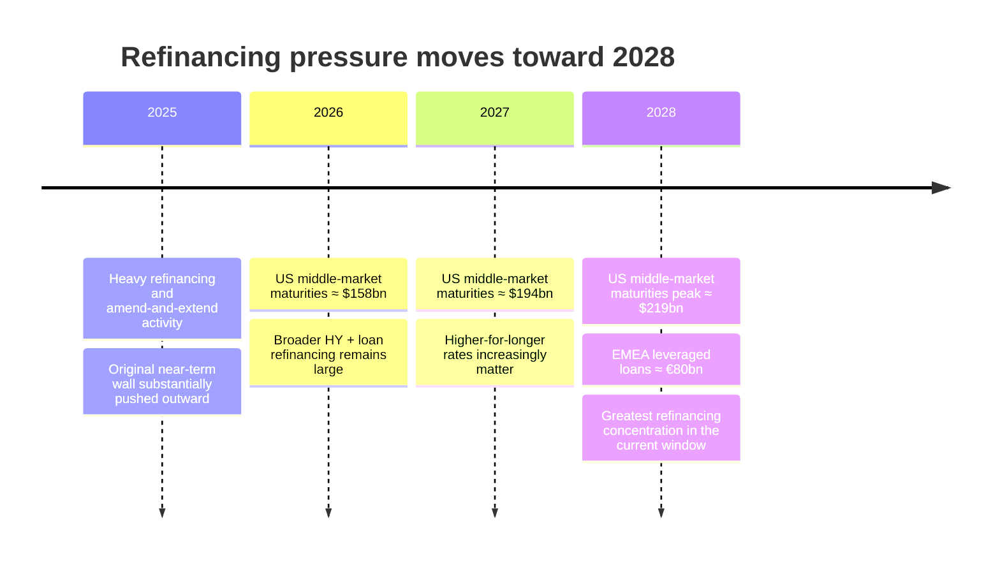
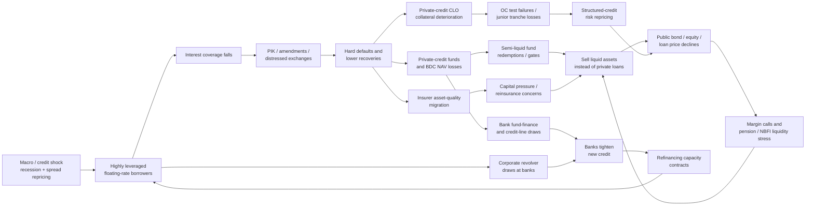

# Private Credit in 2026: Market Scale, Loss Concentration and Systemic Vulnerability

## Executive summary

As of **15 September 2026**, the most defensible conclusion is that there is no single, observable “private credit market size.” The latest global official assessment, the Financial Stability Board’s May 2026 report, estimates **$1.5–2.0 trillion at end-2024** under a relatively narrow definition centered on non-bank direct lending to medium-sized companies. The IMF used an approximately **$2 trillion** figure in 2024, while commercial and industry estimates range from roughly **$2.1 trillion to $3.5 trillion** because they increasingly include asset-based finance, private investment-grade debt, distressed/special-situations debt, BDC portfolios and other privately originated assets. The largest high-quality broad estimate should therefore not be interpreted as evidence that narrow corporate direct lending has suddenly doubled. citeturn18search4turn23search7turn12search3turn6search8

The market is **less bank-like than the label “shadow banking” can imply**. Traditional closed-end private-credit funds are predominantly funded with committed long-term equity capital and have little classic deposit-like maturity transformation. Recent academic work and ECB analysis put average balance-sheet leverage around **30% of assets for U.S. private-credit funds and about 40% for euro-area private-debt funds**. That is a much larger equity cushion than a bank has. This is the principal reason the FSB, ECB, IMF and recent academic literature do not currently view a standalone private-credit shock as an obvious 2008-style banking crisis. citeturn25search0turn23search31turn25search14

The vulnerabilities are nevertheless meaningful because leverage exists at **several layers simultaneously**: the underlying borrower, the private-credit vehicle or BDC, the private-equity sponsor, CLO structures, insurers and pension investors, and bank credit lines or fund-finance facilities. Private-credit borrowers are typically smaller, more levered and more floating-rate exposed than public-market peers; the IMF estimated in 2024 that **more than one-third of comparable borrowers had interest expense exceeding current earnings**. citeturn23search7turn9view0

The most transparent leveraged vehicles, BDCs, now include very large balance sheets. Ares Capital had about **$31.2 billion of assets**, Blue Owl Capital Corp. **$17.2 billion**, Blackstone Secured Lending **$14.7 billion**, FS KKR **$13.7 billion**, and Golub Capital BDC **$8.9 billion** in the Spring 2026 Houlihan Lokey snapshot. BDC leverage is capped through statutory asset-coverage rules, but their equity NAV is still mechanically sensitive to loan markdowns. citeturn26view1

The other important concentrations are outside funds themselves. FSB estimates suggest roughly **10% of North American life-insurer portfolios** may qualify as private credit using private-placement/private-rating proxies, versus about 3% for non-life insurers; in most jurisdictions surveyed by the IAIS, estimates remain below 5% of insurer assets. Private-equity-linked insurers held structured securities equal to roughly **27% of portfolios at end-2024**, compared with about 12% at other large insurers, while private-equity-controlled insurers were associated with almost **$900 billion of insurance liabilities**. citeturn10view4

Banks' direct exposure is important but not, on current evidence, remotely comparable to their pre-2008 mortgage balance sheets. FSB member data identify about **$220 billion of drawn and undrawn bank credit lines to private-credit funds**; commercial datasets imply perhaps **$270–500 billion**. A separate international survey found approximately $268 billion of bank lending to private-credit entities at end-2023, with a median exposure of only 0.2% of bank assets, although the most exposed bank reached 4.4%. The bigger concern is *contingent* exposure—undrawn lines, portfolio financing, warehouse facilities, revolvers to the same corporate borrowers, and synthetic risk transfer. citeturn9view0turn11view2turn11view3

Credit deterioration is considerably harder to measure than in syndicated loans. Moody's Analytics estimates that the **2025 direct-lending default rate was about 1.6% if distressed exchanges are excluded but 4.7% if they are included**. The FSB similarly finds roughly 1% outright defaults but about 5% when selective defaults are counted. This difference is economically important: restructurings, PIK toggles, maturity extensions and lender amendments can keep a borrower out of a “hard-default” dataset even though creditors have already suffered economic impairment. citeturn15search12turn15search6turn10view2

PIK is therefore one of the best current warning indicators. Fitch reported average PIK income at **7.8% of interest and dividend income among 32 rated BDCs in Q2 2025**, versus a recent peak of 8.2%; Fitch data cited in a 2026 analysis put the full-year 2025 average at **8.1%, up from 7.7% in 2024 and roughly twice pre-2020 levels**. KBRA's direct-lending data show that loans using some PIK had an average **2025 implied recovery of 41.6 cents on the dollar, versus 52.6 cents for non-PIK loans**. citeturn24search26turn24search22turn24search11

The near-term “maturity wall” has been postponed rather than eliminated. Morgan Stanley/PitchBook/LSEG data for U.S. middle-market BDC and syndicated loans show **$158 billion maturing in 2026, $194 billion in 2027 and $219 billion in 2028**, the peak year. Separately, Fitch estimates approximately **€80 billion of EMEA leveraged loans mature in 2028**, about 21% of the relevant maturity profile. The dominant U.S. syndicated-loan stock remains overwhelmingly covenant-lite: the last readily comparable public Morningstar/LSTA figure located for this report was **above 90% in 2024**. Private direct lending generally retains more maintenance covenants, although competition has weakened documentation. citeturn26view2turn20search1turn20news36turn23search7

My central stress simulation—a deliberately severe **2008-style credit-spread/liquidity shock, not a literal replay of 2008 monetary policy**—uses a $1.75 trillion narrow-market midpoint. A 10% default rate and 45% recovery produces about **$96 billion of ultimate credit loss**; a simultaneous 15% mark-to-market/illiquidity discount would represent about **$263 billion of gross valuation impairment** before recoveries and therefore should not be added mechanically to the $96 billion. A severe tail of 15% defaults and 35% recovery implies approximately **$171 billion of principal losses**. These are scenario outputs, not forecasts.

The most plausible systemic mechanism is consequently not “private-credit loans default, banks instantly fail.” It is a **multi-stage liquidity and confidence loop**: borrower distress → PIK/restructurings → BDC/fund marks → semiliquid redemptions and insurer capital pressure → bank credit-line tightening → corporate revolver draws → public-credit repricing and sales of liquid assets → broader credit contraction. The FSB's August 2026 warning that global markets remain vulnerable to a disorderly correction makes this network channel more relevant than simply comparing private-credit AUM with bank assets. citeturn2view1turn18search4

## Market perimeter, size and definitional conflicts

The central measurement problem is that **“private credit,” “private debt,” “direct lending,” “BDC assets” and “private-credit CLOs” are not synonyms**. The FSB explicitly says that there is no common global definition and that published market-size estimates vary substantially because of different taxonomies. Its preferred narrow perimeter is non-bank direct lending to medium-sized companies through bilaterally negotiated loans, often to private-equity-sponsored borrowers. Broader industry definitions can also include distressed debt, venture debt, mezzanine finance, asset-based finance, private investment-grade placements, infrastructure debt and other privately originated loans. citeturn9view0turn18search4

### Comparative market-size estimates

| Source and publication date | Reference date | Method / perimeter | Reported size | Assessment of comparability |
|---|---:|---|---:|---|
| **FSB, May 2026** | End-2024 | Narrow non-bank direct lending to medium-sized companies; synthesis of member and commercial data | **$1.5–2.0tn** | **High confidence** as the current official benchmark; deliberately narrow. citeturn18search4turn27view0 |
| **IMF GFSR, Apr. 2024** | 2023/early 2024 | Global private credit; investment funds + BDCs + related vehicles | **≈$2tn** | **High/medium**; authoritative, but somewhat broader than the FSB's final 2026 perimeter. citeturn23search7turn28view0 |
| **Preqin, Nov. 2024 update** | Mar. 2024 | Private-credit/private-debt fund AUM: North America $966.2bn, EMEA $467.7bn, APAC $84.1bn | **≈$1.52tn** | **Medium-high** for institutional fund AUM; omits some balance-sheet/private-placement exposures. citeturn12search11 |
| **McKinsey, Sept. 2024** | End-2023 | “Commonly measured” private credit, principally managed vehicles/closed-end funds holding private loans | **Nearly $2tn** | **Medium**; broader consulting perimeter. citeturn12search9 |
| **Goldman Sachs, May 2025** | 2025 | Private-credit AUM | **≈$2.1tn** | **Medium**; useful market estimate but not a regulatory census. citeturn12search3 |
| **Morgan Stanley, Oct. 2025** | Start-2025 | Broad private-credit market | **≈$3tn** | **Medium-low for comparison with FSB** because the perimeter is broader. citeturn12search4 |
| **AIMA/ACC, Dec. 2025** | 2025 | Broad private-credit industry survey/market definition | **$3.5tn** | **Medium-low for narrow direct lending; medium for the broad private-credit ecosystem**. citeturn6search8 |
| **Moody's Analytics, Apr. 2026** | 2026 forecast/current assessment | Corporate private-credit lending AUM | **Expected to exceed $2tn in 2026** | **Medium**; forecast rather than observed global stock. citeturn15search12 |

**My preferred working range is therefore $1.5–2.0 trillion for narrow corporate direct lending and roughly $2–3.5 trillion for broader “private credit/private debt.”** The upper range should not be added to the $1.5–2 trillion figure; it largely contains it. The $30 trillion figure occasionally associated with private credit is not current AUM: McKinsey's 2026 work describes an *addressable financing universe* once asset-based finance, mortgages, infrastructure and other markets are included. citeturn12search6

The overlap problem can be illustrated as follows.

**Direct lending** is an asset/origination channel. **Private debt** is a strategy family. **A BDC** is a legal/investment vehicle and may own direct loans, syndicated loans, equity and structured products. **A CLO** is a securitization vehicle: traditional CLOs predominantly own broadly syndicated leveraged loans, whereas middle-market/private-credit CLOs can own directly originated loans. Counting the underlying private loan and the CLO securities backed by that loan as two separate pieces of credit would double-count the same corporate exposure. citeturn9view0turn10view3

Likewise, syndicated leveraged loans and private credit increasingly substitute for each other. Large borrowers can refinance from BSL into direct lending and later refinance back into syndicated markets. Direct lenders can now execute transactions above **$5 billion**, which erodes the historical distinction that “private credit = small middle market” and “BSL = large borrower.” citeturn26view2

This creates a fundamental data problem. A “private-credit AUM” number can measure **fund commitments, invested NAV, gross loan assets, vehicle assets, origination volume or privately originated debt held by insurers**. Those are not interchangeable. FSB's decision to publish a range rather than a point estimate is therefore analytically appropriate. citeturn9view0turn18search4

## Where leverage and loss concentration sit

The most important distinction is between **where leverage is created** and **who ultimately absorbs losses**. Borrowers contain the highest operating/financial leverage; funds and BDCs add a second layer; insurers, pensions and other LPs ultimately own much of the equity risk; banks provide significant contingent liquidity; CLOs redistribute—not eliminate—credit risk.

| Sector | Quantified current exposure | Leverage / loss concentration | Principal players or structures |
|---|---|---|---|
| **Borrowers** | Narrow market finances roughly $1.5–2tn of loans globally. | Often single-B-like, smaller, highly floating-rate and more leveraged than public peers. IMF found >⅓ of comparable borrowers' interest cost exceeded earnings after the rate shock. citeturn27view0turn23search7 | PE-sponsored middle-market companies; increasingly upper-middle-market/large-cap borrowers. |
| **Private-credit funds** | Largest component of the ecosystem; European Parliament synthesis estimates closed-end funds at ≈81% of the 2024 market. | ECB: U.S. PC fund leverage around **30% of assets**; euro-area private-debt funds around **40%**. Closed-end capital materially reduces run risk. citeturn24search18turn25search0 | Ares, Apollo, Blackstone, KKR, Blue Owl, HPS/BlackRock, Oaktree, Golub and other large platforms; concentration has increased. citeturn12search24turn24search0 |
| **BDCs** | Roughly **14%** of the 2024 private-credit ecosystem in one official parliamentary synthesis; IMF's 2024 framework showed roughly **$0.3tn**. citeturn24search18turn28view0 | BDC statutory asset-coverage constraints cap balance-sheet borrowing, but NAV losses are amplified relative to unlevered loan portfolios. Non-traded/perpetual BDCs add redemption risk. | ARCC $31.2bn assets; OBDC $17.2bn; BXSL $14.7bn; FSK $13.7bn; GBDC $8.9bn in the Spring-2026 public-BDC snapshot. citeturn26view1 |
| **Private-credit / middle-market CLOs** | **≈$155bn outstanding in Oct. 2025**, about **16% of the $977bn U.S. CLO market**. citeturn10view3 | Highly tranched structures concentrate first losses in CLO equity/junior debt; senior notes are term-funded, reducing classic runnable funding risk. Private-credit CLOs generally have larger equity cushions and lower cov-lite exposure than BSL CLOs. citeturn10view3 | CLO managers are frequently affiliated with large private-credit platforms. |
| **Insurers** | Proxy suggests **≈10% of North American life-insurer portfolios** may be PC, ~3% non-life; most IAIS jurisdictions estimate <5%. citeturn10view4 | PE-linked insurers: structured securities ≈**27% of assets**, versus ~12% at other large insurers. Almost **$900bn of insurance liabilities** were controlled by PE-backed insurers in FSB's cited data. citeturn10view4 | Life insurers, PE/asset-manager-affiliated insurers and offshore reinsurers are the key nodes. |
| **Pension/retirement funds** | In the euro area, insurers and pensions together provide roughly **43%** of private-debt-fund investor capital; EEA pension funds had **6.6% of assets in the broader alternatives bucket** including PC, PE and infrastructure in Q3 2025. citeturn11view0turn4view4 | Low redemption pressure at the pension entity itself, but substantial illiquidity plus LDI/derivative collateral requirements can force sales of *liquid* assets under stress. citeturn4view4turn19search6 | Large North American, European and Canadian public/occupational pensions. Granular PC-only global allocations are not publicly standardized. |
| **Banks** | FSB member data: **≈$220bn** drawn + undrawn credit lines; commercial estimates **$270–500bn**. Separate survey: ≈$268bn at end-2023. citeturn27view0turn11view2 | Median surveyed exposure ≈**0.2% of bank assets**, maximum ≈4.4%. Loss concentration is less important than contingent liquidity from undrawn commitments, warehouse/portfolio financing and common borrowers. citeturn11view2turn11view3 | Large U.S., European and global investment/commercial banks providing subscription lines, NAV/portfolio financing and revolvers. |

**BDCs.** Their primary exposure is straightforward: they own loans directly, mostly senior secured and floating-rate. As an example of the structure, Blue Owl Capital Corporation reported a **$15.0 billion portfolio across 229 companies at June 2026, with 79% senior secured and 96% of its debt portfolio floating-rate**. BDCs finance those portfolios with equity, unsecured notes and bank facilities; FSB reports that up to 90% of bank lending to BDCs in some datasets takes the form of credit lines. citeturn24search12turn11view3

The floating-rate characteristic is initially beneficial to lenders when policy rates rise, but it transfers the duration shock to borrowers: coupons reset upward faster than borrower earnings. That eventually comes back to the BDC as PIK, amendments, nonaccruals, NAV write-downs and lower recoveries. citeturn23search31turn23search7

**Insurers.** Exposure comes through at least four routes: direct private placements and privately rated corporate loans; LP interests in private-credit funds; structured products including CLOs; and increasingly **funded reinsurance**, in which liabilities and supporting assets move to a reinsurer that may itself invest heavily in private and structured credit. Affiliation between insurers and alternative asset managers can add common ownership, valuation and concentration channels. citeturn10view4turn9view0

For insurers, the systemic issue is not normally overnight redemption. It is **asset-quality migration and capital**. Rating downgrades, lower fair values, higher required capital, collateral calls or concerns over the quality of assets backing annuity liabilities can lead to de-risking. FSB therefore emphasizes funded reinsurance and alternative-manager ownership as channels deserving monitoring. citeturn10view4turn21search0

**Pension funds.** The direct channel is private-debt LP interests, separately managed accounts and co-investments. The indirect channel can be more acute: a rate or currency shock creates margin calls on LDI and hedging derivatives, while the private-credit portfolio cannot readily be sold. The fund therefore raises cash by selling government bonds, investment-grade bonds or equities—the exact mechanism demonstrated by the 2022 UK LDI episode. citeturn4view4turn19search6

**Guarantee and risk-transfer exposures are another definitional blind spot.** Banks increasingly use synthetic risk-transfer structures in which credit risk on bank-originated assets is passed to private-capital investors without the bank loan itself leaving the balance sheet. Such protection is economically similar to a contingent credit exposure for the protection seller but will generally not appear in a simple “direct lending AUM” total. citeturn9view0

## Credit quality: PIK, defaults, recoveries and the maturity wall

**PIK is best interpreted as a liquidity-pressure indicator, not automatically a default.** A PIK election capitalizes interest into loan principal rather than requiring cash payment. This can be economically sensible for a temporarily cash-constrained but viable company, but repeated PIK means that reported interest income can rise while actual lender cash receipts fall and borrower leverage compounds. The FSB specifically identifies PIK, revolving-credit draws and restructurings as mechanisms borrowers are using to manage cash constraints. citeturn10view1

The observable BDC evidence is striking:

| PIK indicator | Latest useful observation | Interpretation |
|---|---:|---|
| Fitch-rated BDCs, PIK / interest + dividend income | **7.8% in Q2 2025**, down from 8.2% recent peak | Material non-cash component of accounting income. citeturn24search26 |
| Full-year BDC PIK income | **8.1% in 2025**, 7.7% in 2024; about 2× pre-2020 | Structural rise since the low-rate era. citeturn24search22 |
| Private-credit loan stock using PIK | Industry data indicate roughly **14% around Mar. 2025** | Less robust than BDC accounting data; perimeter varies materially. |
| KBRA 2025 implied recovery, loans that PIKed | **41.6¢/$** | Approximately 11 points below non-PIK loans. citeturn24search11 |
| KBRA 2025 implied recovery, non-PIK | **52.6¢/$** | PIK is correlated with materially weaker credit outcomes. citeturn24search11 |

There is **no authoritative global series for “PIK as a share of new private-credit issuance.”** Different datasets count original-issue PIK features, later PIK toggles and amendments differently. That is an important data gap rather than a statistic that should be filled by extrapolation. Academic work by Rintamäki and Steffen uses loan-level BDC data and finds that PIK is particularly important for borrowers without alternative bank liquidity, supporting the interpretation of PIK as endogenous liquidity support/forbearance rather than simply a loan feature. citeturn18search1turn18search4

**Defaults are highly definition-dependent.** Moody's estimates the 2025 direct-lending rate at **about 1.6% excluding distressed exchanges and 4.7% including them**. Moreover, roughly **65% of all Moody's corporate defaults in 2025 were distressed restructurings**, and historical Moody's data show that more than 70% of eventual hard defaults following a soft credit event occur within two years. Thus a low “bankruptcy/missed-payment” rate can coexist with substantial economic stress. citeturn15search12turn15search6

The FSB's cross-source synthesis reaches essentially the same conclusion: **roughly 1% outright default versus roughly 5% once selective defaults are included**. citeturn10view2

European KBRA data provide another useful check. AFME's June 2026 market report cites a **2025 European direct-lending default rate of about 2% by borrower count and 1% by volume**, with KBRA expecting roughly **2.25% by count and 1% by volume in 2026**. citeturn19search30

For recoveries, KBRA's Direct Lending Index showed an **average implied recovery of roughly 45 cents in 2025, down from 51 cents in 2024**. The PIK/non-PIK split—41.6 cents versus 52.6 cents—is particularly informative because it shows that the loans where borrowers are preserving cash are also the ones for which the market anticipates greater principal impairment. citeturn24search11

A direct historical private-credit versus leveraged-loan comparison is harder than it appears:

| Period | Private credit evidence | Leveraged-loan / public-credit benchmark | What can actually be concluded |
|---|---|---|---|
| **2008–09 GFC** | **No robust modern market-wide PC default series.** Today's large direct-lending industry barely existed in its current form, and current datasets do not provide an apples-to-apples backtest. | Public leveraged loans experienced low-double-digit stress/default conditions and severe secondary-market discounts during the GFC; covenant structure and recovery definitions materially affect comparisons. | A 2008 stress test for modern PC must use leveraged loans as a *proxy*, not claim historical PC calibration. |
| **2013–22** | IMF/Cliffwater's ten-year analysis found average annual private-credit losses were **not outsized**, attributing the result partly to structural risk mitigants. citeturn28view0 | Mostly benign corporate-credit cycle interrupted by the short 2020 shock. | Historical PC losses were low, but the sample largely predates the present scale, higher rates and retail/semi-liquid structures. |
| **Q2 2024** | Proskauer series cited by Preqin: about **2.71%** private-credit default rate. | Broadly syndicated loan comparison about **4.33%** in the cited dataset. citeturn12search4 | PC hard-default rates could look lower because amendments/workouts occur earlier and definitions differ. |
| **2025** | Moody's: **1.6–4.7%**, depending on treatment of distressed exchanges. citeturn15search12 | Public speculative-grade rates remained in the mid-single-digit area depending on universe/definition. | Definition of “default” now explains a large portion of the apparent private/public gap. |
| **2026 Europe** | KBRA forecast: **2.25% count / 1% volume** direct lending. citeturn19search30 | S&P European speculative-grade bond rate was 3.3% in Q1 2026. citeturn19search30 | Larger private deals are performing better than simple borrower counts imply; different universes prevent direct equivalence. |

Recovery comparisons are also structurally changing. IOSCO notes that in U.S. leveraged lending, **average and median recoveries on covenant-lite facilities have been respectively about 11% and 34% lower than on comparable non-cov-lite facilities** in the analysis it cites. citeturn20search23

The **maturity wall has shifted outward toward 2028** after several years of refinancing and amend-and-extend activity. For U.S. middle-market debt specifically, Morgan Stanley's September 2025 dataset combines BDC and syndicated middle-market loans and gives the following profile. citeturn26view2

| Maturity year | U.S. middle-market BDC + syndicated loans | Assessment |
|---|---:|---|
| **2025** | Not separately reported in the forward series as of 30 Sept. 2025 | Much of the original 2025 wall had already matured, refinanced or been extended. |
| **2026** | **$158bn** | Manageable in normal markets, but vulnerable to a funding freeze. citeturn26view2 |
| **2027** | **$194bn** | Meaningful step-up. citeturn26view2 |
| **2028** | **$219bn** | **Peak year** in this series. citeturn26view2 |

This is a *middle-market* series, not the whole speculative-grade universe. Apollo separately estimated that **more than $620 billion of high-yield bonds and loans** would mature across 2026–27, illustrating how much larger the broader refinancing ecosystem is. In EMEA leveraged loans, Fitch places about **€80 billion—roughly 21% of the relevant maturity schedule—in 2028**. These numbers should not be added because their universes overlap. citeturn20search24turn20search1

The covenant issue cuts differently across private and public markets. More than **90% of the Morningstar LSTA U.S. leveraged-loan index was covenant-lite in the last readily comparable 2024 public reading**, whereas direct loans historically contain maintenance covenants that enable earlier lender intervention. FSB nevertheless sees evidence of weakening private-credit underwriting as capital competition increases; meanwhile private-credit CLOs still have materially less cov-lite collateral than traditional BSL CLOs. citeturn20news36turn23search7turn10view3

## Stress test and systemic contagion

A conceptual correction is important. **2008 was principally a credit-spread, solvency and liquidity shock, not a sustained upward policy-rate shock; risk-free rates ultimately fell sharply.** The relevant experiment for current private credit is therefore a 2008-style *repricing and financing freeze* imposed on today's already high-coupon, largely floating-rate borrowers.

For calibration I use the **$1.75 trillion midpoint** of the FSB's $1.5–2 trillion narrow estimate. Current data establish a reasonable starting point: observed 2025 default estimates range roughly 1.6–4.7% depending on distressed-exchange treatment, current implied direct-lending recoveries are around the mid-40-cent area in KBRA's index, and more than one-third of borrowers in the IMF's earlier analysis had exceptionally weak interest coverage. citeturn27view0turn15search12turn24search11turn23search7

The scenarios below are **analytical assumptions, not predictions**. Realized principal loss is:

\[
\text{Credit loss}
=
\text{Exposure}
\times
\text{Default rate}
\times
(1-\text{Recovery rate})
\]

| Scenario | Default rate | Recovery | Gross credit loss on $1.75tn | Private-loan valuation mark | Gross mark-to-market impairment | Funding assumption |
|---|---:|---:|---:|---:|---:|---|
| **Fragile normalization** | 4% | 55% | **$31.5bn / 1.8% of assets** | –5% | **$87.5bn** | Refinancing remains open; limited gating |
| **2008-style central stress** | 10% | 45% | **$96.3bn / 5.5%** | –15% | **$262.5bn** | New originations freeze; bank lines tighten; semi-liquid requests materially exceed gates |
| **Severe tail** | 15% | 35% | **$170.6bn / 9.75%** | –25% | **$437.5bn** | Broad liquidity freeze, repeated restructurings, large NAV discounts and asset sales |

**The credit-loss and valuation columns are not additive.** A loan marked to 75–85 cents during a panic may subsequently recover much of that value; conversely, some seemingly modest marks can eventually crystallize into larger losses. The distinction matters particularly in private credit because model-based quarterly marks historically move substantially less than traded leveraged-loan prices during stress. The IMF has warned that this valuation smoothing can cause a sudden confidence problem once reported NAVs catch up with economic values. citeturn23search7turn28view0

**BDC/fund equity amplification.** If a fund's debt equals 30–40% of assets, a 15% asset markdown translates mechanically into about a **21–25% loss of equity NAV** before income and hedges. A BDC operating at 1:1 debt/equity—50% debt/assets—would experience approximately a **30% equity-NAV decline** from the same 15% asset shock. This is balance-sheet arithmetic rather than a forecast; actual BDC responses would include retained income, liability structure, hedges, asset realizations and covenant/coverage limits. The relevant empirical anchor is that private-credit fund leverage is roughly 30% in the U.S. and 40% in the euro area. citeturn25search0

**The run scenario is now observable rather than hypothetical.** In 2026, redemption requests at several U.S. semi-liquid/private BDC structures exceeded contractual withdrawal limits; FSB notes structures with gates around **5% of NAV**, and ECB records sizeable redemption requests in open/semi-open private-credit vehicles. Blackstone's flagship BCRED was among the funds facing requests around 10% of assets against a substantially lower periodic redemption allowance. Traditional closed-end funds are largely protected from this mechanism, which is why the rapid growth of perpetual/semi-liquid products matters disproportionately for systemic risk. citeturn11view0turn4view3turn24news46

**Bank liquidity amplification.** Against the FSB's $220–500 billion range of bank commitments/exposures, a scenario in which even 20% of commitments suddenly become additional liquidity demand corresponds to **$44–100 billion of gross funding pressure**. This is not the same as a bank loss; it illustrates the scale of contingent balance-sheet usage if private funds and common corporate borrowers simultaneously draw facilities while banks are trying to reduce risk. citeturn27view0turn11view2

**Insurer impact.** Using the FSB's approximate 10% private-credit share for North American life portfolios, a 15% economic markdown of the entire PC bucket equals a gross **1.5% hit to total assets** before accounting treatment, capital charges, hedges and recoveries. For a PE-linked insurer whose structured-security share is 27%, the same hypothetical 15% mark across *all* those securities would equal about **4.1% of total assets**—an intentionally conservative upper-bound illustration, not a prediction, because structured securities are not all private credit and different tranches have very different loss sensitivity. citeturn10view4

**Pension impact is primarily a liquidity/valuation problem.** EEA pension funds' entire alternatives bucket is only 6.6% of assets, and private credit is a subset, so even a 15% mark on the whole 6.6% bucket would equal roughly **1% of total assets**. The more plausible destabilizing channel is that derivative margin calls require immediate cash while private assets remain illiquid and slow-marked, causing sales in liquid bond or equity markets. citeturn4view4turn19search6

**CLOs create loss concentration, not necessarily runs.** With approximately $155 billion of private-credit/middle-market CLOs outstanding, deteriorating collateral first hits the CLO equity and junior tranches. Senior notes benefit from structural subordination and term funding, but defaults can trigger overcollateralization tests, trap cash and accelerate deleveraging. citeturn10view3

The resulting systemic map is:

This is why the **systemically dangerous state variable is not merely private-credit default rates; it is the correlation of defaults, NAV marks, redemption requests, bank-line draws and insurer/pension liquidity needs**. FSB and ECB both conclude that first-round direct exposures appear manageable today while second-round market and funding effects are less certain because data on interconnectedness are incomplete. citeturn9view0turn4view0

## Rating agencies versus academic evidence

A superficial reading suggests disagreement: rating-agency data increasingly emphasize defaults, PIK, restructurings and weak recoveries, while recent academic research often finds that private-credit **fund balance sheets themselves are comparatively robust**. These positions are not necessarily contradictory. They are measuring different objects.

| Source | Date | Metric / estimate | Assumptions and methodology | What it implies |
|---|---|---|---|---|
| **Moody's Analytics / Moody's default database** | Apr.–May 2026 | 2025 PC default proxy **1.6% hard default; 4.7% including distressed exchanges** | Maps direct-lending universe onto observed corporate credit events; definition of “default” drives the range. citeturn15search12turn15search6 | Underlying stress is materially greater than bankruptcy/missed-payment statistics alone imply. |
| **FSB synthesis of S&P/Fitch/IMF data** | May 2026 | Around **1% outright; ≈5% including selective defaults** | Cross-dataset comparison rather than single homogeneous cohort. citeturn10view2 | Strong evidence of “extend/restructure before hard default.” |
| **KBRA DLD** | 2026 | Europe: **2.25% count / 1% volume** 2026 forecast; 2025 recovery index ≈**45¢** | Loan/deal-level direct-lending database, with larger deals receiving greater weight in volume metric. citeturn19search30turn24search11 | Defaults remain moderate, but recovery severity has deteriorated. |
| **Fitch BDC surveillance** | Aug. 2025 / 2026 reporting | PIK ≈**7.8–8.1% of BDC income** | Public BDC financial statements; unusually transparent subset of PC. citeturn24search26turn24search22 | Accounting income increasingly includes non-cash accruals, which can mask cash-flow strain. |
| **IMF / Cliffwater empirical analysis** | Apr.–Jul. 2024 | 2013–22 average annual PC credit losses described as historically **not outsized** | Ten-year historical realized-loss window; largely predates the full higher-rate stress and current retail/semi-liquid scale. citeturn28view0 | Historical loss experience was benign, but may not be representative of the next downturn. |
| **Matvos, Piskorski & Seru, NBER** | Mar.–Aug. 2026 | PC funds' balance sheets are far more equity-funded than banks; ECB summarizes U.S. fund leverage at about **30% of assets** | Comprehensive fund- and asset-level balance-sheet approach rather than issuer-default forecasting. citeturn25search14turn25search0 | A loan-loss shock need not become a run-driven intermediary insolvency in the way it can at deposit-funded banks. |
| **Rintamäki & Steffen** | 2025–26 | PIK is concentrated among liquidity-constrained borrowers and can function as lender forbearance | Loan-level BDC/private-credit data; studies contract modification rather than market-wide expected loss. citeturn18search1turn18search4 | “Low defaults” can partly represent endogenous restructuring, so cash-flow information is essential. |

There is therefore **no credible academic consensus number such as “private credit will lose X% in the next downturn.”** The best academic literature is mostly answering a different question: *given a certain amount of loan loss, does the funding structure force rapid liquidation or insolvency?* Recent evidence says traditional funds are relatively well capitalized and long-funded. Rating agencies instead ask: *how many underlying borrowers are deteriorating, restructuring or defaulting, and what are recoveries?* Both dimensions are needed for a systemic assessment. citeturn25search14turn15search12

The rating-agency numbers may look more pessimistic because a distressed exchange can be classified as a default even if it prevents bankruptcy. Academic/fund-level analyses may look more benign because **the loss can be absorbed by locked-up investor equity without creating a runnable intermediary**. Neither method alone tells us whether the ultimate pensioner, insurer, retail BDC investor or bank counterparty has borne an economic loss. citeturn15search6turn25search0

There is also a **valuation-frequency problem**. Public leveraged loans continuously incorporate changes in spreads; private loans are commonly revalued quarterly using models and manager judgments. The IMF found considerably smaller reported private-loan price movements during stress despite weaker borrower characteristics, while public BDC shares can trade at sizeable discounts to stated NAV. Consequently, private-market measured volatility can understate economic volatility without implying fraud or incorrect ultimate recovery. citeturn23search7turn28view0

Finally, private lenders can intervene earlier precisely because they have tighter lender groups and historically stronger covenants. That can improve ultimate recoveries, but it can simultaneously reduce the informational value of conventional default statistics: a bilateral amendment, PIK toggle or sponsor equity injection may solve the liquidity event before a missed payment occurs. This is why **cash interest coverage, PIK, nonaccruals, amendments and fair-value migration should be monitored alongside defaults**. citeturn10view1turn24search11

## Conclusions and policy implications

The evidence does **not** support the strongest version of the “private credit is the next 2008 banking crisis” thesis. Traditional private-credit funds do not fund long-dated risky assets with runnable insured deposits; most remain closed-ended; average fund leverage is relatively modest; banks' directly measured exposures are small relative to banking-system assets and CET1; and euro-area authorities still assess direct systemic exposure as limited. citeturn23search31turn25search0turn27view0turn4view0

It also does **not** support complacency. The industry has never been tested at today's scale through a prolonged recession with high borrower coupons. Its borrowers are relatively fragile, PIK usage is elevated, distressed exchanges account for a large fraction of credit events, recoveries in stressed direct lending have weakened, semi-liquid structures have already experienced redemption requests exceeding gates, and the 2028 refinancing concentration remains substantial. citeturn23search7turn24search22turn15search6turn24search11turn11view0turn26view2

The principal systemic vulnerability is **risk migration rather than risk disappearance**. Bank balance sheets contain less of the underlying corporate loan risk than under a bank-centric model, but insurers, pension funds, BDC shareholders, CLO equity holders and private-fund LPs now absorb more of it. Banks remain connected through subscription facilities, portfolio/NAV financing, warehouse credit, revolving facilities to borrowers, derivatives and synthetic risk transfer. citeturn9view0turn11view3

The strongest policy response is therefore **better look-through measurement**, not an assumption that private credit should simply be regulated identically to banks. Supervisors need a common taxonomy separating direct lending, private placements, ABF, BDCs and private-credit CLOs; borrower-level identifiers that prevent double counting; reporting of drawn **and undrawn** bank facilities; fund leverage including NAV and portfolio financing; insurer look-through exposure including affiliated and offshore reinsurance; and pension/private-fund holdings. These priorities closely match the FSB's May 2026 recommendations. citeturn9view0turn18search4

Liquidity regulation should concentrate on the part of the market that has become economically runnable: **evergreen and semi-liquid retail/private-wealth funds**. Redemption terms need to be consistent with the realistic liquidation horizon of the assets, with stress tests explicitly assuming simultaneously falling NAVs and redemption requests above contractual gates. The fact that requests exceeded fund limits during 2026 makes this a demonstrated vulnerability rather than a purely theoretical one. citeturn11view0turn4view3

Insurance supervision should focus on **concentration, affiliated transactions, privately assigned ratings, funded reinsurance and true economic asset-liability matching**. A loan that is technically long-dated and held to maturity can still cause solvency pressure if downgrades raise required capital or if liabilities and assets have been moved through complex reinsurance structures whose ultimate risk bearer is difficult to identify. citeturn10view4turn21search0

For banks, the correct stress test is not simply “assume X% of private-credit loans default,” because banks often do not own those loans. It is **simultaneous utilization of undrawn fund credit lines and corporate revolvers, deterioration of collateral on portfolio/NAV facilities, counterparty stress, and inability to distribute warehouse exposures or execute synthetic risk transfer**. The FSB's $220–500 billion exposure range indicates why gross commitments and contingent claims matter more than a narrow on-balance-sheet loan number. citeturn27view0turn11view3

For investors and regulators, PIK should be separated from cash income in headline performance reporting. A useful surveillance dashboard would disclose **cash yield, PIK yield, PIK principal capitalization, nonaccruals, distressed exchanges, amendments, realized recoveries and fair-value migration**. The current situation—where hard-default rates can be near 1–2% while broader credit-event measures approach 5%—demonstrates that conventional default statistics alone are insufficient. citeturn10view2turn24search26

The key quantitative threshold from the stress exercise is that a genuinely severe downturn need not generate trillion-dollar losses to become disruptive. On a $1.75 trillion narrow market, a **10% default / 45% recovery scenario produces roughly $96 billion of ultimate loan losses**, while a 15% illiquidity/credit-spread mark produces a temporary gross valuation shock of roughly **$263 billion**. That is readily absorbable by a highly equity-funded private-fund sector in aggregate, but it could be highly destabilizing if concentrated in leveraged BDC equity, insurer capital, CLO junior tranches and semi-liquid funds at the same moment that banks tighten $220–500 billion of connected financing relationships.

The central systemic judgment is therefore:

> **Private credit in 2026 looks more like a potential amplifier of a broad corporate-credit and NBFI liquidity shock than an autonomous replica of the 2008 banking system.**

Its traditional closed-end funding architecture is a genuine source of resilience. Its **opacity, layered leverage, growing insurer/reinsurance links, PIK-based forbearance, semi-liquid retail structures and dependence on bank contingent liquidity are the vulnerabilities**. The probability of a private-credit shock causing a banking-system solvency crisis by itself still appears relatively low on the available official evidence; the probability that private credit materially magnifies losses and liquidity pressure during a synchronized leveraged-finance downturn is substantially higher. That distinction is the most important one for both portfolio construction and macroprudential policy as the **2027–28 refinancing window approaches**. citeturn18search4turn4view0turn2view1

---
**Sources:**
- [Report on Vulnerabilities in Private Credit](https://www.fsb.org/?utm_source=chatgpt.com)
- [Stress in global private credit markets and its implications for ...](https://www.ecb.europa.eu/press/financial-stability-publications/fsr/special/html/ecb.fsrart202605_04~3f2135af91.en.html?utm_source=chatgpt.com)
- [Fast-Growing $2 Trillion Private Credit Market Warrants ...](https://www.imf.org/en/blogs/articles/2024/04/08/fast-growing-usd2-trillion-private-credit-market-warrants-closer-watch?utm_source=chatgpt.com)
- [BDC Monitor | Spring 2026](https://www2.hl.com/pdf/2026/bdc-monitor-spring-2026.pdf)
- [Report on Vulnerabilities in Private Credit](https://www.fsb.org/uploads/P060526.pdf)
- [Default rates are easing. Credit risk is fragmented and fragile across markets.](https://www.moodys.com/web/en/us/insights/credit-risk/private-credit/us-corporate-default-risk-in-2026.html?utm_source=chatgpt.com)
- [PIK Income Fell Modestly in 2Q25 for BDCs, Dividend ...](https://www.fitchratings.com/research/corporate-finance/pik-income-fell-modestly-in-2q25-for-bdcs-dividend-coverage-varies-26-08-2025?utm_source=chatgpt.com)
- [https://www.morganstanley.com/im/publication/insights/articles/article_evolutionofdirectlending.pdf](https://www.morganstanley.com/im/publication/insights/articles/article_evolutionofdirectlending.pdf)
- [FSB Chair’s letter to G20 Finance Ministers and Central Bank Governors: August 2026 - Financial Stability Board](https://www.fsb.org/2026/08/fsb-chairs-letter-to-g20-finance-ministers-and-central-bank-governors-august-2026/)
- ['Keep a close eye on private credit' – Dechert - Preqin](https://www.preqin.com/news/keep-a-close-eye-on-private-credit-dechert?utm_source=chatgpt.com)
- [The next era of private credit - McKinsey](https://www.mckinsey.com/industries/private-capital/our-insights/the-next-era-of-private-credit?utm_source=chatgpt.com)
- [Private credit's outlook amid rising volatility | Goldman Sachs](https://www.goldmansachs.com/insights/articles/private-credits-outlook-amid-rising-volatility?utm_source=chatgpt.com)
- [Private debt in 2025: the outlook for fundraising, deals, and ... - Preqin](https://www.preqin.com/news/private-debt-in-2025-the-outlook-for-fundraising-deals-and-performance?utm_source=chatgpt.com)
- [Strong growth sees private credit market reach US$3.5 trillion](https://www.aima.org/?utm_source=chatgpt.com)
- [Private credit market enters a new phase | McKinsey](https://www.mckinsey.com/industries/private-capital/our-insights/global-private-markets-report/private-credit?utm_source=chatgpt.com)
- [Private credit: market structure, recent developments, financial ...](https://www.europarl.europa.eu/RegData/etudes/BRIE/2026/784039/ECTI_BRI%282026%29784039_EN.pdf?utm_source=chatgpt.com)
- [[PDF] Clearer view, tougher terrain - McKinsey](https://www.mckinsey.com/~/media/mckinsey/industries/private%20equity%20and%20principal%20investors/our%20insights/mckinseys%20global%20private%20markets%20report/2026/global-private-markets-report-2026-full-report.pdf?utm_source=chatgpt.com)
- [Financial Stability Review, May 2026](https://www.ecb.europa.eu/press/financial-stability-publications/fsr/html/ecb.fsr202605~50566915a7.en.html)
- [Blue Owl Capital Corporation (OBDC)](https://www.blueowlcapitalcorporation.com/?utm_source=chatgpt.com)
- [Global Financial Stability Report, April 2024, “The Rise and ...](https://www.imf.org/-/media/files/publications/gfsr/2024/april/english/ch2execsum.pdf?utm_source=chatgpt.com)
- [In a warning sign, analysis shows publicly traded credit ...](https://www.reuters.com/legal/transactional/warning-sign-analysis-shows-publicly-traded-credit-funds-are-unprofitable-2026-07-01/?utm_source=chatgpt.com)
- [PIK loans drag implied recoveries for KBRA DLD Direct ...](https://www.kbra.com/analytics/products/dld/insights/pik-loans-drag-implied-recoveries-kbra-dld-direct-lending-index?utm_source=chatgpt.com)
- [When Flexibility Becomes Forbearance: Payment-in-Kind ...](https://papers.ssrn.com/?utm_source=chatgpt.com)
- [European High Yield, Leveraged Loan, and Private Credit ...](https://www.afme.eu/publications/data-research/european-high-yield-leveraged-loan-and-private-credit-report-q1-2026/?utm_source=chatgpt.com)
- [Presentation by Jason Wu, IMF Asia-Pacific Regional Seminar, July 18, 2024](https://www.imf.org/-/media/files/oap/oap-home/2024/jason-wu-gfsr-april-2024-ch-2-private-credit.pdf)
- [Leveraged Loans and CLOs Good Practices for ...](https://www.iosco.org/?utm_source=chatgpt.com)
- [[PDF] 2025 Credit Outlook: Defying Gravity - Apollo Global Management](https://www.apollo.com/content/dam/apolloaem/documents/insights/aopllo-global-2025-credit-outlook.pdf?utm_source=chatgpt.com)
- [Ignoring risk, investors still buying US junk debt with weak protections](https://www.reuters.com/markets/us/ignoring-risk-investors-still-buying-us-junk-debt-with-weak-protections-2024-09-17/?utm_source=chatgpt.com)
- [Private Credit, Balance Sheets and Financial Stability](https://www.nber.org/papers/w34991?utm_source=chatgpt.com)
- [Lend, extend, and then...](https://www.moodys.com/web/en/us/insights/credit-risk/private-credit/lend-extend-and-then.html?utm_source=chatgpt.com)