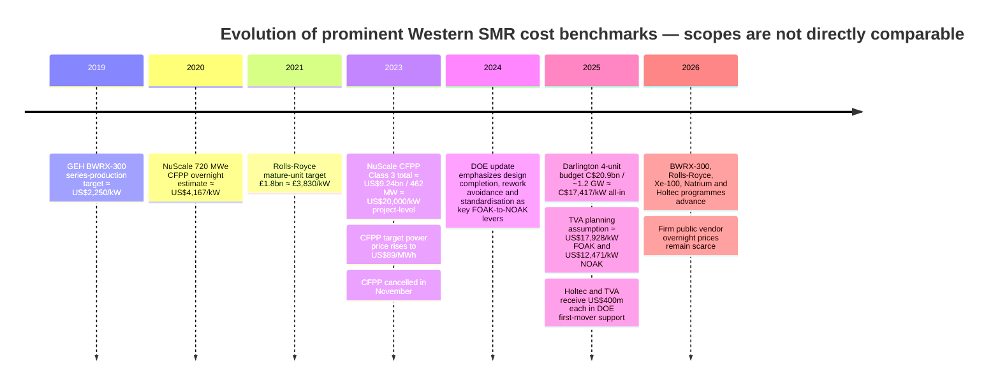
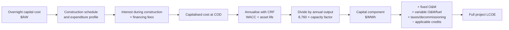

You are an expert evaluator scoring two research reports on the same topic.
You do NOT know which system produced which report. Score each on the rubric below.

IMPORTANT: Score based on EVIDENCE, not eloquence. A well-written but shallow report must NOT score higher than a less polished but factually rigorous one.

TOPIC: "What is the current capital cost per kW of small modular reactors?"

### REPORT A
# Current Capital Cost per kW of Small Modular Reactors

## Executive summary

As of **13 September 2026**, there is no single defensible “current SMR capital cost per kW.” The public evidence separates into three very different classes: **vendor/mature-fleet targets**, generally expressed as overnight capital cost; **utility planning estimates**, which are usually more conservative; and **actual FOAK project/program budgets**, which frequently include financing, escalation, owner’s costs, shared infrastructure, R&D, or fuel facilities. Treating these as interchangeable is the main reason published SMR cost comparisons can differ by factors of two to five. The U.S. Department of Energy defines overnight capital cost as construction cost without financing, while noting that construction and financing together drive roughly 70–80% of nuclear LCOE. citeturn22view0turn23view2

The strongest current evidence points to a large gap between **mature-design aspirations** and **first-project reality**. GE Hitachi’s widely cited BWRX-300 series-production target was roughly **US$2,250/kW**, Rolls-Royce historically targeted about **£3,830/kW** for an early mature-fleet unit, DOE’s original advanced-nuclear commercialisation framework used **US$3,600/kW** as a NOAK reference, EPRI has published an illustrative NOAK SMR estimate of about **US$5,134/kW**, and the U.S. National Academies cited roughly **US$4,600–5,400/kW** for NOAK advanced reactors. These are engineering/learning-curve targets rather than prices demonstrated by completed Western SMR projects. citeturn16search2turn16search16turn32search18turn21search6turn12search16turn17search3

By contrast, the latest major FOAK project and planning benchmarks are much higher. Ontario Power Generation’s four-unit Darlington BWRX-300 programme has a **C$20.9 billion total budget for roughly 1.2 GW**, or **C$17,417/kW**, explicitly including interest, cost escalation and contingency. The first unit itself is budgeted at C$6.1 billion, with another C$1.6 billion of common systems and services shared by the four-unit programme. citeturn13search0turn14view0 The cancelled NuScale/UAMPS Carbon Free Power Project reached a **US$9.24 billion Class 3 project estimate for 462 MW**, equivalent to about **US$20,000/kW**, but that figure was not an overnight construction cost: it incorporated owner’s costs, financing assumptions and other project costs. citeturn31view0turn31view1 TVA’s 2025 planning assumptions for a BWRX-300 have been publicly reported at about **US$17,928/kW FOAK** and **US$12,471/kW NOAK**; importantly, these are planning assumptions, not an approved Clinch River construction budget. The federal government subsequently awarded TVA US$400 million to advance Clinch River and follow-on deployments. citeturn11search3turn31view10

For X-energy and TerraPower, a plant-only overnight number is not publicly disclosed in the current official material. X-energy’s 2023 **US$4.75–5.75 billion** ARDP estimate covers not only the four-reactor, 320 MW Xe-100 plant, but also standard-plant design and licensing and a commercial TRISO fuel fabrication facility; simply dividing by 320 MW yields **US$14,844–17,969/kW**, but that is a **programme-cost-per-generating-kW**, not an OCC. citeturn30search7 TerraPower’s Natrium ARDP arrangement authorises up to US$2 billion of DOE funding matched dollar-for-dollar; roughly US$4 billion divided by the 345 MW reactor rating gives **US$11,594/kW**, but again the scope includes design, licensing, methods development, fuel qualification and two supporting facilities, so it must not be presented as plant overnight cost. citeturn31view4

For Holtec, the current official FOAK Palisades plan is two 340 MWe SMR-300 units, supported by a **US$400 million DOE award** and contemplated DOE Loan Programs Office construction financing, but Holtec does not publish an official current OCC in the cited announcement. citeturn31view3turn31view10 For Rolls-Royce, the current 470 MWe design is moving into contracted UK and European programmes, but the current official website does not publish a plant capital price; the best-known historical target remains £1.8 billion, while more recent press reporting has placed a first unit around £2.5 billion and later units around £2.0 billion. citeturn32search2turn32search25turn32news42

The most defensible **present planning envelope**, therefore, is not a narrow point estimate. For Western FOAK **overnight** SMRs, I would use approximately **US$6,000/kW low, US$10,000/kW central, and US$18,000/kW high** as scenario anchors—not as a statistical confidence interval. For mature NOAK plants, approximately **US$3,600/kW low, US$5,100/kW central, and US$12,500/kW high** captures the striking difference between engineering-learning models and conservative utility planning. DOE’s original FOAK range was about US$6,000–10,000/kW, while current TVA planning sits near the high end of the wider envelope. citeturn21search1turn21search6turn12search16turn11search3 **All-in FOAK project costs can exceed US$20,000/kW-equivalent**, as the NuScale CFPP experience demonstrates, without implying that US$20,000/kW is the reactor’s overnight EPC cost. citeturn31view1

The financing implication is large. With a 60-year life and 90% capacity factor, every **US$1,000/kW** of capital corresponds to roughly **US$6.7/MWh of capital-only LCOE at a 5% WACC, US$9.0/MWh at 7%, and US$11.5/MWh at 9%**, before construction-period financing, O&M, fuel, taxes and decommissioning. DOE illustrates the construction-finance effect separately: at a 5% interest rate, US$100 of overnight capital becomes roughly US$122 after a five-year construction period and US$150 after ten years. citeturn22view0 This is why execution time and cost of capital are almost as important as the quoted overnight $/kW.

## Definitions, scope and methodology

### What “overnight cost” actually means

DOE defines **overnight capital cost, or OCC**, as the cost of constructing the plant **without the impact of financing costs**, conceptually as though it were constructed “overnight.” citeturn22view0 That does **not** mean every published OCC has the same accounting boundary. Depending on the study, OCC may include or exclude owner's engineering, site preparation, switchyards/interconnection, initial fuel, contingency and other indirect costs. World Nuclear Association notes that owner’s costs and contingencies can be components of overnight cost in standard nuclear cost accounting. citeturn17search6

For this report I therefore distinguish four scopes:

| Scope label | Meaning used here |
|---|---|
| **Overnight / OCC** | Direct and indirect construction expenditure before financing; exact owner/grid/contingency boundary depends on source. |
| **All-in project capital** | OCC plus some or all of escalation, interest during construction, owner's costs, development costs and shared infrastructure. |
| **Programme-level FOAK cost** | May also include reactor design, licensing, R&D, fuel-fabrication or test facilities. X-energy and Natrium currently fall largely into this category. |
| **LCOE** | Lifetime revenue requirement per MWh, incorporating capital recovery, financing and operating costs; not interchangeable with $/kW. |

The distinction is decisive. A **US$5,000/kW OCC estimate and US$15,000/kW programme-level FOAK figure can both be internally correct** if the latter includes financing, first-time engineering, fuel facilities and supporting infrastructure that the former excludes. DOE explicitly separates overnight cost from financing and identifies both as major determinants of nuclear LCOE. citeturn23view2

### FOAK and NOAK are concepts, not universally fixed unit numbers

**FOAK, first-of-a-kind**, normally refers to the first commercial deployment of a design or design family, carrying non-recurring engineering, first-time licensing, immature supply-chain and construction-learning risks. **NOAK, Nth-of-a-kind**, means a repeat deployment after the design, suppliers and construction process have become substantially standardised. DOE’s 2024 analysis explicitly associates the FOAK-to-NOAK transition with design completion, design maturity, cross-site standardisation, orderbook size, supplier proficiency and EPC/architect-engineer experience. citeturn23view1turn24view1

There is no universal rule that the fifth, tenth or twentieth reactor is automatically “NOAK.” DOE illustrates learning curves out to the **10th and 20th units**, while Rolls-Royce’s historical £1.8 billion target was associated in industry reporting with approximately the fifth unit. citeturn23view2turn32search18 Consequently, “NOAK” should be read as a **maturity assumption**, not as a precise ordinal designation.

This matters particularly for Clinch River. A TVA BWRX-300 would be an early U.S. deployment, but if Darlington proceeds first it would no longer be the global design FOAK. The correct economic description is therefore **U.S. first/early-of-a-kind**, not necessarily global FOAK. GE Vernova Hitachi currently describes NOAK BWRX-300 construction as approximately 24–36 months from first nuclear concrete to fuel-load readiness. citeturn31view5

### Currency treatment

Values below are shown primarily in their **source currencies and source-year price bases**; I do not silently convert pounds or Canadian dollars to U.S. dollars. Where a source itself reported a USD equivalent, I show it separately. I also do **not inflation-normalise estimates from different years**, because doing so could create spurious comparability where project scopes differ more substantially than inflation.

For Darlington, World Nuclear News reported the C$20.9 billion programme as approximately **US$15.1 billion** in May 2025; this corresponds to an implied source conversion of about **C$1.384/US$1** and a source-reported USD-equivalent cost of about **US$12,583/kW** for 1.2 GW. The official Ontario/OPG budget itself is in Canadian dollars. citeturn4search13turn32search11

## Vendor and project cost benchmarks

### Comparative vendor and project table

The table deliberately retains programme-level figures rather than pretending they are overnight costs. “Unspecified” means that I found no disclosed value in the cited public cost source rather than substituting an analyst assumption.

| Vendor / project | Estimate year | Currency and cost | Implied cost per kW | FOAK / NOAK | Capacity factor assumed in cited cost estimate | Financing / discount assumption | Scope and interpretation |
|---|---:|---|---:|---|---|---|---|
| **NuScale VOYGR / CFPP — earlier vendor estimate** | 2020 | ~US$3.0bn overnight for then-720 MWe configuration | **~US$4,167/kW OCC** | FOAK estimate | Unspecified | N/A to quoted overnight figure | Historical overnight estimate; later configuration and economics changed substantially. citeturn32search19 |
| **GE Hitachi BWRX-300** | 2019-era target; current site accessed 2026 | US$ target | **~US$2,250/kW** | Series-production / NOAK target | Unspecified | N/A to overnight target | Widely cited GEH long-run target. Current GE Vernova Hitachi material does **not** publish a current numeric price; it specifies 300 MWe and 24–36 month NOAK construction. citeturn16search2turn16search16turn31view5 |
| **X-energy Xe-100 / Seadrift ARDP programme** | 2023 | **US$4.75–5.75bn** | **US$14,844–17,969/kW programme-equivalent**, using 320 MWe | FOAK | Unspecified | ARDP cost-sharing; project WACC/discount rate unspecified | **Not OCC.** Includes standard Xe-100 design/licensing, commercial TRISO-X fuel fabrication facility and construction of four 80 MWe reactors at Seadrift. citeturn30search7turn30search9 |
| **TerraPower Natrium** | Current ARDP framework | Up to ~US$4bn combined DOE/private programme if full US$2bn DOE authorisation is matched | **~US$11,594/kW programme-equivalent**, using 345 MWe | FOAK | Unspecified | 50/50 ARDP cost share; WACC unspecified | **Not OCC.** Includes design/licensing, codes and methods, fuel development/qualification and two supporting facilities as well as the demonstration plant. citeturn31view4 |
| **Holtec SMR-300 / Palisades PIONEER 1&2** | 2025 | Official total plant capex **unspecified**; secondary reporting has cited ~US$2.1–2.7bn/reactor | Official OCC: **unspecified**. Secondary implied value is roughly **US$6,176–7,941/kW** if divided by current 340 MWe/unit rating | FOAK | Unspecified | DOE US$400m first-mover award; Holtec says DOE LPO construction financing is envisaged; rate/WACC unspecified | Official project is 2 × 340 MWe = 680 MWe. The US$2.1–2.7bn figure is secondary and its overnight/all-in boundary is unclear, so it should not be treated as a bankable OCC. citeturn31view3turn4search11turn31view10 |
| **Rolls-Royce SMR** | 2021 historical target; 2025–26 programme current | **£1.8bn** historical mature-unit capex; recent press reporting ~£2.5bn first unit / ~£2.0bn subsequent | **£3,830/kW** historical £1.8bn target; ~**£5,319/kW** at £2.5bn; ~**£4,255/kW** at £2.0bn | £1.8bn target approximately early-mature/fifth unit; £2.5bn is press-reported first-unit estimate | Unspecified | Plant WACC unspecified; UK public programme funding is separate from plant capex | Current design is 470 MWe. Current official RR website does not publish a firm plant price; the £2.5bn UK government SMR programme should **not** be read as the price of one reactor. citeturn32search2turn32search18turn32search25turn32news37turn32news42 |
| **Darlington New Nuclear Project, Ontario — BWRX-300** | 2025 budget | **C$20.9bn** for 4 units / ~1.2 GW; first unit C$6.1bn; common systems/services C$1.6bn | Fleet: **C$17,417/kW**. First-unit budget alone: **C$20,333/kW**. Source-reported total USD equivalent: ~**US$12,583/kW** | First unit design FOAK; four-unit early fleet | Unspecified | Project-specific WACC unspecified; total budget already includes interest | **All-in, not OCC:** official budget includes interest, cost escalation and contingency. Shared C$1.6bn infrastructure serves the fleet. citeturn13search0turn14view0turn15view0turn4search13 |
| **UAMPS Carbon Free Power Project — NuScale** | 2023 Class 3 estimate | **US$9.24bn** for 462 MWe | **~US$20,000/kW project-level** | FOAK | Unspecified in public cost announcement | Absolute WACC/discount rate unspecified; updated interest-rate assumptions, DOE cost sharing and IRA benefits entered economics | **Not OCC.** Reported scope included owner’s costs, acquisition/construction, financing assumptions and O&M-related cost elements. Target electricity price became US$89/MWh in July-2022 dollars. Project terminated Nov. 8, 2023. citeturn31view0turn31view1turn32search1turn32search5 |
| **TVA Clinch River — BWRX-300** | 2025 planning basis; project active in 2026 | Publicly reported TVA planning values **US$17,928/kW FOAK; US$12,471/kW NOAK** | **US$17,928/kW FOAK** ≈ US$5.38bn/300 MW; **US$12,471/kW NOAK** ≈ US$3.74bn/300 MW | U.S. early-of-a-kind; not necessarily global design FOAK | Unspecified in cited cost line | Project WACC unspecified; DOE awarded TVA US$400m first-mover support in Dec. 2025 | Planning OCC assumptions, **not an approved Clinch River total construction budget**. Current official federal announcement identifies one BWRX-300 at Clinch River plus subsequent deployment plans. citeturn11search3turn31view10 |

Two observations stand out from this table. First, **current official vendor webpages frequently avoid publishing firm overnight $/kW numbers**: GEH emphasises constructability, X-energy and TerraPower disclose demonstration-programme scopes, Holtec discloses government support and financing pathway, and Rolls-Royce publishes capacity and programme progress rather than a current turnkey price. citeturn31view5turn30search3turn31view4turn31view3turn32search2 Second, where utilities have had to put real projects into budgets or resource plans, the resulting numbers are substantially above the early vendor NOAK targets. citeturn14view0turn31view1turn11search3

### Darlington deserves special treatment

Ontario’s C$20.9 billion figure is probably the most important current Western SMR cost benchmark because it is attached to an authorised, four-unit BWRX-300 project rather than a generic vendor model. But calling **C$17,417/kW “the BWRX-300 overnight cost” would be incorrect**. OPG explicitly says the C$20.9 billion figure includes **interest, cost escalation and contingency**. citeturn14view0turn15view1

The first reactor is budgeted at **C$6.1 billion** and common systems/services at **C$1.6 billion**. Adding all common infrastructure to the first unit would produce C$7.7 billion, or C$25,667/kW against a single 300 MW denominator, but that is economically misleading because the common assets support subsequent units. The four-unit average of **C$17,417/kW** is therefore the more meaningful programme metric. citeturn14view0

This also illustrates an important SMR economic mechanism: a multi-unit site can incur a large shared-site bill upfront and then amortise it over later reactors. Comparing the first reactor’s cheque size with an nth-unit factory target will systematically exaggerate the apparent technology cost gap unless shared assets are allocated consistently.

### X-energy and Natrium cannot responsibly be quoted as simple reactor $/kW

X-energy’s US$4.75–5.75 billion estimate is unusually transparent about scope. X-energy states that it covers **design and licensing of the standard Xe-100 plant, design/licensing/construction of the TRISO-X commercial fuel fabrication facility, and construction of the four-unit Seadrift facility**. citeturn30search7 Dividing the total by 320 MW is useful only as an exposure metric for the overall commercialisation programme; it is **not** evidence that an Xe-100 nuclear island costs US$15,000–18,000/kW overnight.

The same applies to Natrium. TerraPower says its ARDP FOAK cost includes reactor design and licensing, methods development, fuel development/qualification and the design, construction and operation of the **Natrium Fuel Fabrication Facility and Sodium Test and Fill Facility**. citeturn31view4 A US$4 billion/345 MW division therefore bundles infrastructure that future units should not have to duplicate.

These two cases help explain why the economic transition from FOAK to NOAK can be large without requiring contractors simply to become dramatically cheaper: **non-recurring costs disappear from the numerator.**

## FOAK, NOAK and cost uncertainty

### Published FOAK-to-NOAK benchmarks

| Source / basis | FOAK benchmark | NOAK benchmark | Implied reduction | Interpretation |
|---|---:|---:|---:|---|
| **DOE Commercial Liftoff, original framework** | ~**US$6,000–10,000/kW OCC** | Repeat builds expected to lower OCC by roughly 40%; LCOE illustration used ~US$9,000 FOAK and **US$3,600 NOAK** | ~40% in headline framework; larger in selected model comparison | Generic advanced nuclear, not vendor-specific. citeturn21search1turn21search6 |
| **DOE 2024 updated learning framework** | Index **100** for unconstrained FOAK; about **65** after eliminating major rework/delay | Index about **35** after additional standardisation, workforce learning and bulk ordering | ~65% vs poor FOAK, ~46% vs “best-practice FOAK” | Illustrative relative cost decomposition rather than a dollar forecast. citeturn23view1 |
| **TVA BWRX planning assumption** | **US$17,928/kW** | **US$12,471/kW** | ~30% | Utility resource-planning assumption; much more conservative than early vendor targets. citeturn11search3 |
| **EPRI illustrative NOAK SMR case** | — | **~US$5,134/kW** | — | NOAK benchmark with approximately three-year construction in the cited comparison; publication-year detail was not explicit in the retrieved extract. citeturn12search16 |
| **U.S. National Academies** | — | **~US$4,600–5,400/kW** | — | Advanced-reactor NOAK range; model/assessment, not contracted price. citeturn17search3 |
| **GEH BWRX-300 historical vendor target** | — | **~US$2,250/kW** | — | Series-production target; materially below current utility planning. citeturn16search2turn16search16 |
| **Rolls-Royce historical mature-unit target** | Press reports now put first unit around £2.5bn ≈ **£5,319/kW** | £1.8bn historical target ≈ **£3,830/kW**, associated with roughly the fifth build | ~28% from £2.5bn to £1.8bn | Different currency and uncertain accounting scope; useful only within the Rolls-Royce sequence. citeturn32search18turn32news42 |

DOE’s updated analysis is especially useful because it separates **avoiding FOAK failure modes** from ordinary learning. In its illustrative index, simply preventing major rework and delays moves a notional cost from 100 to roughly 65; design standardisation, workforce experience and bulk purchasing then take the mature figure toward 35. citeturn23view1 The implication is that a high FOAK cost should not automatically be extrapolated to the twentieth plant—but neither should a NOAK target be used to finance the first plant.

DOE also cautions that empirical learning-rate datasets for repeated nuclear builds are limited. Its illustrative curves show that, depending on learning rate, the twentieth unit might cost anywhere from about 50% to 80% of the first-unit level. citeturn23view2 This uncertainty is fundamental: **NOAK is an outcome to be earned, not an intrinsic property of an SMR design.**

### Plausible min, central and max ranges

No vendor among the six reviewed publishes a public, auditable **P10/P50/P90 probability distribution** for complete plant overnight cost. Consequently, a formal “95% confidence interval” would be false precision. The following are **scenario anchors**, synthesising DOE, EPRI/National Academies, TVA planning and current project evidence; they are not statistically estimated confidence intervals.

| Cost category | Plausible low | Central / “median-like” anchor | Plausible high | What the range means |
|---|---:|---:|---:|---|
| **FOAK overnight SMR, Western market** | **US$6,000/kW** | **~US$10,000/kW** | **~US$18,000/kW** | Low end reflects DOE’s well-executed commercialisation case; high end is anchored by conservative current utility planning such as TVA. citeturn21search1turn11search3 |
| **NOAK overnight SMR** | **US$3,600/kW** | **~US$5,100/kW** | **~US$12,500/kW** | Low/central values reflect DOE/EPRI/National Academies learning models; high value reflects TVA’s much more conservative NOAK planning assumption. citeturn21search6turn12search16turn17search3turn11search3 |
| **FOAK all-in project/programme exposure** | **~US$10,000/kW-equivalent** | **~US$15,000–18,000/kW-equivalent** | **US$20,000/kW+** | Includes varying amounts of financing, first-time engineering, infrastructure or non-plant scope; **not interchangeable with OCC**. CFPP reached ~US$20,000/kW project-level. citeturn31view1 |

A compact way to visualise the uncertainty is:

```text
Nominal US$/kW                   5k          10k          15k          20k
                                |-------------|-------------|-------------|

FOAK overnight              [ 6k -------- 10k ------------------ 18k ]
NOAK overnight          [3.6k -- 5.1k -------------- 12.5k]
FOAK all-in/project                    [ ~10k -------- ~16k -------- 20k+ ]

                  ← model / mature-fleet territory    project / FOAK territory →
```

The **asymmetry of the uncertainty is important**. There are multiple mechanisms by which FOAK costs can rise—schedule extension, design change, labour productivity, financing, commodity inflation and contingency draw—but the low-cost NOAK outcome depends on successfully achieving standardisation, orderbook continuity and factory/supply-chain learning. DOE therefore emphasises committed orderbooks of repeated units as a prerequisite for industrial learning. citeturn21search1turn23view1

## Historical cost escalation and its drivers

The apparent escalation in SMR costs over the past seven years is striking, but it is not a valid construction-cost index because the points below change **design maturity, scope, currency, project configuration and financing treatment**. The timeline is nevertheless useful for understanding how the market moved from vendor targets to executable project budgets. The underlying figures come from GEH industry reporting, NuScale/UAMPS, Rolls-Royce reporting, OPG and TVA planning. citeturn16search16turn32search19turn31view1turn32search25turn14view0turn11search3



### Inflation and commodity prices

NuScale itself attributed the 2023 CFPP increase partly to unusually strong construction inflation, reporting that indices for carbon-steel piping and fabricated steel plate had risen **more than 50% since 2020**. citeturn31view0 IEEFA’s review of the same project identified even larger movements in selected construction inputs, including steep increases in carbon-steel pipe and structural steel, as well as electrical equipment and copper products. citeturn32search0turn1search2

These effects are especially important for nuclear projects because a very large share of cost is conventional civil, mechanical and electrical construction rather than the reactor vessel itself. DOE’s 2024 report notes that more than two-thirds of the cost/material activity in nuclear construction can be associated with non-nuclear portions such as civil construction, underground utilities, switchyards and cooling infrastructure. citeturn24view1

### Interest rates and schedule

The CFPP repricing occurred simultaneously with a materially more expensive financing environment; analyses of the Class 3 estimate noted a roughly **200-basis-point increase in the relevant interest-rate assumption compared with the earlier plan**. citeturn1search2 The project’s target electricity price rose from **US$58/MWh to US$89/MWh**, although the latter was an economic target after specific subsidies/benefits rather than an unsubsidised generic NuScale LCOE. citeturn31view0turn31view1turn32search27

For nuclear, schedule and financing compound each other. DOE gives a simple illustration: with a 5% financing rate, **US$100 of overnight construction cost becomes about US$122 after five years of construction and US$150 after ten years**. citeturn22view0 That means a project can experience a large all-in $/kW increase even if physical quantities and contractor unit prices do not rise proportionately.

### Configuration and denominator changes

Part of the apparent NuScale escalation is also mathematical. The project evolved from a larger **720 MWe configuration** to six 77 MWe modules totalling **462 MWe**. citeturn32search19turn31view0 Shared site, owner and infrastructure costs were therefore spread over fewer kilowatts. A $/kW time series that ignores that denominator change exaggerates pure inflation.

The same effect works in the other direction at Darlington: the C$1.6 billion common-system bill is expensive when attributed solely to unit one but becomes much smaller per kW if spread across all four BWRX-300s. citeturn14view0 Multi-unit deployment is therefore not merely a manufacturing-learning strategy; it also recovers **site-level economies of scale**.

### Design maturity, rework and standardisation

DOE’s updated FOAK-to-NOAK framework finds that eliminating **rework and delays** is potentially a larger cost lever than conventional positive learning effects. Design incompleteness can generate licensing amendments, field redesign and schedule delays; repeated cross-site standardisation reduces those changes, while workforce and supplier repetition improves execution. citeturn23view1turn24view1

This is particularly relevant to advanced non-light-water designs. DOE notes that novel Gen IV plants can carry first-time costs associated with materials, testing infrastructure and immature fuel/supply chains. citeturn23view0 The X-energy and Natrium budgets make those costs visible: their demonstration programmes explicitly include commercial fuel or test facilities that a mature deployment fleet would not rebuild for every reactor. citeturn30search7turn31view4

### Supply chain and workforce

A credible NOAK trajectory requires enough repeat orders to keep skilled construction teams and nuclear-qualified suppliers continuously employed. DOE identifies shortages in skilled trades, nuclear component manufacturing and large forgings, and argues that orderbook scale is needed before suppliers will invest in dedicated manufacturing capacity. citeturn24view1turn21search1

That creates a circular commercial problem: customers want NOAK pricing before ordering, while manufacturers need multiple firm orders before NOAK pricing is achievable. The BWRX-300 programme—Darlington followed potentially by Clinch River and other sites—is one of the clearest current attempts to break that cycle through repeated deployment of the same standardised design. GE Vernova Hitachi explicitly frames its short 24–36 month construction objective as an **nth-of-a-kind** target. citeturn31view5

## From capital cost per kW to LCOE

### The analytical mapping

For a simplified plant whose capital investment is already measured at commercial operation date, the capital component of LCOE can be approximated as:

\[
\text{Capital LCOE}
=
\frac{K\times CRF(r,n)}{8760\times CF}\times1000
\]

where

\[
CRF(r,n)=\frac{r(1+r)^n}{(1+r)^n-1}
\]

and:

- \(K\) = capital cost in US$/kW;
- \(r\) = real WACC or discount rate;
- \(n\) = economic life in years;
- \(CF\) = capacity factor.

This formulation is a useful sensitivity calculation, not a replacement for a project finance model. For an **overnight** cost, construction-period interest and the timing of expenditure must still be layered on before capital recovery; taxes, debt/equity structure, tax credits, O&M, fuel, decommissioning and residual value also affect the full LCOE. DOE likewise separates overnight construction cost from financing cost in its nuclear LCOE framework. citeturn23view2turn22view0



### Capital-only LCOE sensitivity

The following is my calculation using a **60-year life and 90% capacity factor**, with no construction financing, O&M, fuel, taxes or subsidies. The 90% CF is an illustrative round assumption rather than a vendor-specific assumption; DOE reports that the U.S. operating nuclear fleet achieved about a 93% capacity factor in 2023. citeturn22view2

| Capital cost | 5% WACC | 7% WACC | 9% WACC |
|---:|---:|---:|---:|
| **US$5,000/kW** | **US$33.5/MWh** | **US$45.2/MWh** | **US$57.4/MWh** |
| **US$10,000/kW** | **US$67.0/MWh** | **US$90.3/MWh** | **US$114.8/MWh** |
| **US$15,000/kW** | **US$100.5/MWh** | **US$135.5/MWh** | **US$172.2/MWh** |
| **US$20,000/kW** | **US$134.0/MWh** | **US$180.7/MWh** | **US$229.6/MWh** |

The key result is linearity with respect to $/kW but strong non-linearity with respect to financing. At a 7% WACC and 90% CF, **each additional US$1,000/kW adds about US$9.0/MWh of capital-only LCOE**. At 9%, it adds about US$11.5/MWh.

Consequently, a mature plant at US$5,000/kW can plausibly support a capital component around US$45/MWh at a 7% WACC, while a US$15,000/kW FOAK under the same assumptions starts around US$136/MWh **before** fuel, O&M or construction finance. This illustrates why a FOAK/NOAK capital-cost distinction is not cosmetic—it can determine whether the eventual electricity price differs by tens of dollars per MWh.

### What current DOE LCOE modelling assumes

DOE’s 2024 Liftoff analysis shows nuclear LCOE sensitivity across overnight costs of roughly **US$8,000–20,000/kW**. Its illustrated financing assumptions include a **six-year construction period, 80% debt, 5% debt interest and a 30% investment tax credit**; those assumptions are a modelling case, not a claim about every 2026 project’s financing terms or current tax eligibility. citeturn22view0

DOE estimates construction-related costs—overnight capital plus financing—to account for roughly **70–80% of nuclear LCOE**. citeturn23view2 The economic priority is therefore two-dimensional: reduce physical construction cost **and** shorten the period over which capital sits unproductive.

That is also why simply comparing Darlington’s all-in C$/kW with GEH’s old US$2,250/kW NOAK target is analytically invalid. The former contains financing, escalation and contingency; the latter is a mature-series target. citeturn14view0turn16search16 A meaningful LCOE comparison first has to put both estimates on the same scope, price year, financing convention, capacity factor and tax basis.

## Investment interpretation and bottom line

The public evidence supports five fairly robust conclusions.

**First, early vendor cost claims are best treated as NOAK design objectives, not current executable EPC prices.** The BWRX-300’s ~US$2,250/kW series target, Rolls-Royce’s £1.8 billion mature-unit target and DOE’s US$3,600/kW NOAK modelling case describe what serial deployment could achieve after learning and standardisation. citeturn16search16turn32search18turn21search6 None has yet been demonstrated by a completed Western commercial SMR fleet.

**Second, real FOAK commitments are presently an order of magnitude closer to US$10,000–20,000/kW than to US$2,000–4,000/kW when broad project scope is included.** Darlington is C$17,417/kW all-in across four units; CFPP reached about US$20,000/kW project-level before cancellation; TVA planning has placed BWRX FOAK OCC near US$17,928/kW. citeturn14view0turn31view1turn11search3 These figures do **not** prove all SMRs will cost US$18,000–20,000/kW overnight, because two of the three contain wider scope than OCC.

**Third, Darlington is the most informative current test of the SMR learning thesis.** Its four-unit format should reveal whether shared-site infrastructure and repetition can bring the marginal costs of units two through four materially below the first unit. The official C$20.9 billion programme already bundles this fleet strategy into one budget. citeturn13search0turn14view0 If later-unit construction does not achieve substantial savings, the economic case for factory repetition becomes materially weaker; if it does, comparing the first unit alone with NOAK targets will look increasingly misleading.

**Fourth, advanced designs such as Xe-100 and Natrium require unusually careful scope adjustments.** Their current public “cost” numbers partly fund the industrial ecosystem—fuel fabrication, licensing, testing and first-time engineering—not merely the generating asset. citeturn30search7turn31view4 These programme expenditures may be economically necessary for the first deployment but should largely disappear or be amortised over a fleet.

**Fifth, the cost of capital is a first-order technology variable for nuclear economics.** A US$10,000/kW plant at a 5% cost of capital has a capital-only LCOE of roughly US$67/MWh under the illustrative assumptions above; at 9%, the same physical plant rises to about US$115/MWh before operating expenses. DOE’s construction-duration example shows that longer build times further magnify this difference. citeturn22view0 Government loan guarantees, regulated-asset structures, public ownership and long-term offtake arrangements can therefore matter nearly as much to delivered electricity cost as reactor engineering.

The practical benchmark I would use today for modelling is consequently:

> **FOAK Western SMR OCC:** approximately **US$6,000–18,000/kW**, with **~US$10,000/kW** as a reasonable central sensitivity rather than a forecast.  
> **Mature NOAK OCC:** approximately **US$3,600–12,500/kW**, with **~US$5,000–5,500/kW** representing the centre of major engineering/institutional estimates, but with utility planning evidence warning that realised NOAK costs could remain substantially higher. citeturn21search1turn12search16turn17search3turn11search3  
> **All-in FOAK project exposure:** stress-test **US$15,000–20,000+/kW-equivalent** where financing, owner’s costs, contingency and first-mover infrastructure sit inside the project envelope, as the CFPP and Darlington experience demonstrates. citeturn31view1turn14view0

The largest analytical mistake would be to select a single number—say US$4,000/kW or US$18,000/kW—and call it “the cost of SMRs.” **Both can appear in credible documents because they answer different questions.** A sound valuation or system model should carry at least separate **FOAK overnight, NOAK overnight and FOAK all-in** cases, with explicit construction duration, capacity factor and WACC assumptions.

## Sources and methodological notes

The analysis prioritises official vendor/government disclosures, utility/regulatory filings and institutional research. Secondary sources are used mainly where a public primary document is difficult to retrieve or where they report a historical vendor target. Key source dates and URLs are below.

| Source | Date | URL / use |
|---|---|---|
| U.S. DOE / INL, *Pathways to Commercial Liftoff: Advanced Nuclear*, updated report | 2024 | `https://gain.inl.gov/content/uploads/4/2024/11/DOE-Advanced-Nuclear-Liftoff-Report.pdf` — FOAK/NOAK learning, financing, LCOE and supply-chain framework. citeturn21search3turn23view1turn23view2 |
| U.S. DOE, *Commercializing Advanced Nuclear Reactors Explained in Five Charts* | 30 Mar. 2023 | `https://www.energy.gov/ne/articles/commercializing-advanced-nuclear-reactors-explained-five-charts` — headline FOAK US$6,000–10,000/kW and expected repeat-build reductions. citeturn21search1 |
| NuScale, CFPP Class 3 estimate announcement | 9 Jan. 2023 | `https://www.nuscalepower.com/press-releases/2023/nuscale-reaches-key-milestone-in-the-development-of-the-carbon-free-power-project` — 462 MW configuration, US$89/MWh target and commodity escalation. citeturn31view0 |
| UAMPS, Carbon Free Power Project | 8 Nov. 2023 cancellation | `https://www.uamps.com/carbon-free` — official termination and insufficient subscription. citeturn32search5 |
| NuScale/UAMPS termination announcement | 8 Nov. 2023 | `https://www.nuscalepower.com/press-releases/2023/utah-associated-municipal-power-systems-and-nuscale-power-agree-to-terminate-the-carbon-free-power-project` citeturn32search1 |
| POWER, detailed CFPP Class 3 cost analysis | 2023 | `https://www.powermag.com/novel-uamps-nuscale-smr-nuclear-project-gains-participant-approval-to-proceed-to-next-phase/` — US$9.24bn scope and subsidy/financing treatment. citeturn31view1 |
| GE Vernova Hitachi, BWRX-300 | Current, accessed 13 Sep. 2026 | `https://www.gevernova.com/nuclear/carbon-free-power/bwrx-300-small-modular-reactor` — 300 MW rating and 24–36 month NOAK construction objective; no current numeric plant price. citeturn31view5 |
| Ontario Government, Darlington New Nuclear Project announcement | 8 May 2025 | `https://news.ontario.ca/en/release/1005889/ontario-leads-the-g7-by-building-first-small-modular-reactor` — C$20.9bn four-unit budget and first-unit programme. citeturn13search0turn31view8 |
| OPG Q1 2025 Financial Results | 2025 | Official OPG/OEB filing — confirms C$20.9bn includes interest, escalation and contingency; C$6.1bn first unit and C$1.6bn shared systems. citeturn14view0turn15view0 |
| X-energy, updated ARDP cost estimate | 12 Jun. 2023 | `https://x-energy.com/news/x-energy-ares-acquisition-corporation-announce-strategic-update-to-business-combination-terms/` — US$4.75–5.75bn programme scope. citeturn30search7 |
| TerraPower, Natrium | Current, accessed 13 Sep. 2026 | `https://www.terrapower.com/natrium/` — 345 MW reactor, 50/50 ARDP structure and scope of FOAK support facilities. citeturn31view4 |
| Holtec, PIONEER 1&2 first-mover announcement | 2 Dec. 2025 | `https://holtecinternational.com/hh-40-24/` — 680 MWe dual-unit project, US$400m award and planned LPO financing. citeturn31view3 |
| U.S. DOE, TVA and Holtec Gen III+ first-mover awards | 3 Dec. 2025 | `https://www.energy.gov/articles/energy-department-selects-tva-and-holtec-advance-deployment-us-small-modular-reactors` — US$400m each for TVA and Holtec. citeturn31view10 |
| Rolls-Royce SMR | Current, accessed 13 Sep. 2026 | `https://www.rolls-royce-smr.com/` — current 470 MWe rating and programme status. citeturn32search2 |
| World Nuclear News, Rolls-Royce cost target | 11 Feb. 2021 | `https://world-nuclear-news.org/articles/rolls-royce-on-track-for-2030-delivery-of-uk-smr` — historical £1.8bn capex and £40–60/MWh claim. citeturn32search25 |
| U.S. National Academies | 2023 | NOAK advanced-reactor cost range of roughly US$4,600–5,400/kW used as an independent institutional benchmark. citeturn17search3 |
| EPRI comparative capital-cost study | Publication year unspecified in retrieved extract | Illustrative NOAK SMR OCC of about US$5,134/kW and short construction period. citeturn12search16 |

All arithmetic per-kW conversions in this report are calculated directly from the cited capacity and cost figures. They are rounded to avoid implying greater precision than the underlying estimates warrant. No cross-year inflation adjustment has been imposed, and no currency conversion is made unless a source itself supplies or permits an explicitly identified conversion.

---
**Sources:**
- [Pathways to Commercial Liftoff: Advanced Nuclear](https://gain.inl.gov/content/uploads/4/2024/11/DOE-Advanced-Nuclear-Liftoff-Report.pdf)
- [Small Modular Reactor (SMR) Design Database](https://world-nuclear.org/?utm_source=chatgpt.com)
- [Ontario Leads the G7 by Building First Small Modular Reactor](https://news.ontario.ca/en/release/1005889/ontario-leads-the-g7-by-building-first-small-modular-reactor?utm_source=chatgpt.com)
- [NuScale Reaches Key Milestone in the Development of the Carbon Free Power Project](https://www.nuscalepower.com/press-releases/2023/nuscale-reaches-key-milestone-in-the-development-of-the-carbon-free-power-project)
- [TVA Plans to Submit an Application for a Construction Permit to ...](https://neutronbytes.com/2025/04/20/tva-plans-to-submit-a-construction-permit-application-for-the-bwrx-300-smr-to-the-nrc/?utm_source=chatgpt.com)
- [X-energy and Ares Acquisition Corporation Announce Strategic ...](https://x-energy.com/news/x-energy-ares-acquisition-corporation-announce-strategic-update-to-business-combination-terms/?utm_source=chatgpt.com)
- [TerraPower Natrium | Advanced Nuclear Energy](https://www.terrapower.com/natrium/)
- [Holtec Receives Coveted “Tier 1 First Mover Award” from the USDOE to Accelerate Deployment of its Dual-Unit SMR-300 Plant at the Company’s Palisades Energy Site - Holtec International](https://holtecinternational.com/hh-40-24/)
- [Rolls-Royce SMR: To Deliver Clean, Affordable Energy For All](https://www.rolls-royce-smr.com/?utm_source=chatgpt.com)
- [Commercializing Advanced Nuclear Reactors Explained in Five ...](https://www.energy.gov/ne/articles/commercializing-advanced-nuclear-reactors-explained-five-charts?utm_source=chatgpt.com)
- [Novel UAMPS-NuScale SMR Nuclear Project Gains Participant Approval to Proceed to Next Phase](https://www.powermag.com/novel-uamps-nuscale-smr-nuclear-project-gains-participant-approval-to-proceed-to-next-phase/)
- [BWRX-300 Small Modular Reactor | GE Vernova Hitachi Nuclear](https://www.gevernova.com/nuclear/carbon-free-power/bwrx-300-small-modular-reactor)
- [Canada's first SMR project: How is CAD20.9 billion cost calculated?](https://www.world-nuclear-news.org/articles/what-is-the-budget-for-canadas-first-smr-project?utm_source=chatgpt.com)
- [NuScale Boosts SMR Module Capacity; UAMPS Mulls ...](https://www.powermag.com/?utm_source=chatgpt.com)
- [https://www.oeb.ca/sites/default/files/2025%20Q1%20Financial%20Statements.pdf](https://www.oeb.ca/sites/default/files/2025%20Q1%20Financial%20Statements.pdf)
- [A Comparison of Capital Costs Between Large Light Water ...](https://restservice.epri.com/?utm_source=chatgpt.com)
- [Chapter: 4 The Economic Challenge](https://www.nationalacademies.org/?utm_source=chatgpt.com)
- [Rolls Royce / Company Says Target Cost For UK SMR Is £ ...](https://www.nucnet.org/?utm_source=chatgpt.com)
- [[PDF] Pathways to Commercial Liftoff: Advanced Nuclear - Applied Atomics](https://www.appliedatomics.com/Liftoff-Pathway-Advanced-Nuclear-2023.pdf?utm_source=chatgpt.com)
- [GE-Hitachi Kicks Off BWRX-300 SMR for Estonia](https://neutronbytes.com/?utm_source=chatgpt.com)
- [Eye-popping new cost estimates released for NuScale ...](https://ieefa.org/?utm_source=chatgpt.com)
- [Eye-popping new cost estimates released for NuScale ...](https://ieefa.org/resources/eye-popping-new-cost-estimates-released-nuscale-small-modular-reactor?utm_source=chatgpt.com)
- [[PDF] Pathways to Commercial Liftoff: Advanced Nuclear](https://gain.inl.gov/content/uploads/4/2024/11/DOE-Advanced-Nuclear-Liftoff-Report.pdf?utm_source=chatgpt.com)
- [Carbon Free Power Project | UAMPS](https://www.uamps.com/carbon-free?utm_source=chatgpt.com)
- [Utah Associated Municipal Power Systems (UAMPS) and NuScale ...](https://www.nuscalepower.com/press-releases/2023/utah-associated-municipal-power-systems-and-nuscale-power-agree-to-terminate-the-carbon-free-power-project?utm_source=chatgpt.com)
- [Energy Department Selects TVA and Holtec to Advance Deployment of U.S. Small Modular Reactors | Department of Energy](https://www.energy.gov/articles/energy-department-selects-tva-and-holtec-advance-deployment-us-small-modular-reactors)
- [Rolls-Royce on track for 2030 delivery of UK SMR](https://world-nuclear-news.org/articles/rolls-royce-on-track-for-2030-delivery-of-uk-smr?utm_source=chatgpt.com)


### REPORT B
# Determine the realistic current (2026) capital cost per kW — overnight and all-in — for leading small modular reactor designs, including first-of-a-kind vs nth-of-a-kind trajectories, to support an investment or procurement decision on SMR deployment.

**Research date:** 2026-09-13 · **Sources analyzed:** 13 · **Evidence records:** 55 · **Verified claims:** 53

---

## Executive Summary

For a 2026 decision, credible all-in first-of-a-kind capital costs are $15–20k/kW — NuScale/UAMPS at $20,139/kW and Darlington at ~CAD17,400/kW — far above marketing and overnight figures such as NuScale's 2,850 $2018/kWe. The strongest evidence is OPG's fourth BWRX-300 costing ~33% less than the first, supporting modeled 30–50% FOAK-to-NOAK reductions. The biggest uncertainty: estimates lack component-level breakdowns, consistent-dollar benchmarks, and financing/licensing splits, leaving wide confidence bands. Recommendation: base procurement or investment decisions on all-in first-unit costs, treat NOAK savings as achievable only at real deployment scale, and disregard sub-$5,000/kW overnight claims as non-decision-grade until design certification and financing terms are fixed.

---

## Published $/kW capital cost estimates for leading SMR designs: overnight vs all-in

Published $/kW estimates for leading SMRs are scarce and inconsistent in basis. For NuScale, INL's October 2023 review reports overnight costs (ex-financing) of 2,850 $2018/kWe (12-unit VOYGR, 924 MWe), 3,856 $2018/kWe (685 MWe iPWR), and 5,100 $2015/kWe (570 MWe iPWR) [1]. The FOAK UAMPS 6-unit project (462 MWe) was estimated at 20,139 $2022/kWe all-in, including financing [4]; IEEFA independently derived the same $20,139/kW from the $9.3 billion construction estimate [4]. These figures differ in dollar year, scope, and FOAK/NOAK status, so they are not directly comparable.

| Design | Basis | Cost |
|---|---|---|
| VOYGR 12-unit, 924 MWe | Overnight, $2018 | 2,850/kWe [1] |
| iPWR 12-unit, 685 MWe | Overnight, $2018 | 3,856/kWe [1] |
| iPWR 12-unit, 570 MWe | Overnight, $2015 | 5,100/kWe [1] |
| UAMPS FOAK 6-unit, 462 MWe | All-in, $2022 | 20,139/kWe [1] |

For GEH BWRX-300, no overnight capital cost is published — only LCOE of 44–51 $2019/MWh [1]. GEH's original promise was US$2,250/kW [7], versus OPG's Darlington all-in estimate of ~CAD17,400/kW (2024, incl. interest/contingency) [7]. X-energy publishes no $/kW figure; its NOAK Xe-100 overnight cost carries AACE Class 5 accuracy (-50%/+100%) [2], with illustrative four-reactor lifetime cost of $1.66–2.18B [3]. Confidence is high for NuScale and Darlington, low for Xe-100.

---

## Real-world project evidence: UAMPS/CFPP cancellation and the Darlington BWRX-300 program

The UAMPS Carbon Free Power Project at Idaho National Laboratory illustrates first-of-a-kind escalation. Conceived in 2014 as 12×60 MW NuScale units for $4.2 billion [6], cost reached $6.1 billion by the September 2020 design approval (inference — no direct source), then rose 75% — from $5.3 billion to $9.3 billion — since 2021 on supply-chain commodity prices and a ~200-basis-point interest-rate rise [4]. Target power price climbed from $55/MWh (2016–2020) to $58/MWh after downsizing to six 77 MWe modules, then to $89/MWh (2022 dollars) [4]. On 7 November 2023, 26 of 50 members voted to terminate; commitments covered only 26% of 462 MW versus 80% required [6]. CFPP and NuScale notified the NRC on 10 November; review was suspended 13 November [5].

At Darlington, Ontario approved four 300 MWe BWRX-300 units at C$20.9 billion (2024 dollars, all-in — interest, escalation, contingency — explicitly not overnight) [9]. The first unit is C$6.1 billion (release-quality estimate) plus C$1.6 billion shared infrastructure, totaling C$7.7 billion [8][9]. OPG projects 14.9 cents/kWh over 60 years [8][8]. Derived $/kW is ambiguous (~C$17,400/kW all-in), and no published overnight capital cost exists for the BWRX-300.

---

## FOAK-to-NOAK cost trajectories and learning-curve assumptions

Learning-curve assumptions bound the expected FOAK-to-NOAK capital-cost decline. At a 4.5% technological learning rate, the INL (2014) model yields a nearly 50% reduction in total capital investment cost from first to nth unit [11]. The Generation IV EMWG and Rothwell cite a 3–4.5% learning rate per doubling of rated power, up to 8 GWe [11]; Rosner and Goldberg distinguish 10% learning for fixed capital costs from 2–3% for variable operational costs [11]. NETL's maturity spectrum runs from 0.06 (experimental/FOAK) to 0.01 (mature/NOAK) [11]. NEA/OECD (2011) assign

---

## Normalization to a consistent 2026 basis and cost-certainty assessment


## Quantitative Comparison (normalized)

### All-in capital cost (incl. financing) — FOAK
| Subject | Value | Normalized | Conditions | Source |
|---|---|---|---|---|
| NuScale VOYGR-6 / UAMPS Carbon Free Power Project (6×77 MWe, 462 MWe) | $20,139/kW (2022 USD); $9.3B total construction cost | — | All-in basis incl. financing; FOAK; 6-module 462 MWe; 2022 USD. Trajectory: $4.2B (2014 concept, 12×60 MWe) → $5.3B (2021) → $6.1B (Sep 2020 NRC approval) → $9.3B (Jan 2023); project terminated 7 Nov 2023 (26% of output committed vs 80% required). Overnight-basis literature estimates for 12-unit NuScale plants (2,850 $2018/kWe VOYGR-12; 3,856 $2018/kWe; 5,100 $2015/kWe) are a different basis — not comparable to the all-in FOAK figure. | [4] |

### All-in capital cost (incl. interest, escalation, contingency) — FOAK→NOAK programme
| Subject | Value | Normalized | Conditions | Source |
|---|---|---|---|---|
| GEH BWRX-300 / OPG Darlington New Nuclear Project (4×300 MWe, 1,200 MWe) | C$20.9B total (2024 CAD) ≈ C$17,400/kW; ≈ USD15.1B / ≈ USD12,600/kW | ≈ USD 12,580/kW (derived from source-stated USD15.1B total for 1,200 MWe) | 2024 CAD; includes interest, escalation, contingency — NOT an overnight-cost estimate. First unit C$6.1B (release-quality) + C$1.6B shared infrastructure (C$7.7B first-unit budget); fourth unit C$4.1B (~33% lower — NOAK trajectory); first unit under construction, grid connection expected end-2030; LCOE est. 14.9¢/kWh CAD contingent on federal ITC; GEH's original design target was US$2,250/kW (US$700M/reactor), several times below approved costs. | [9] |

### Total lifetime cost (vendor illustrative; NOT capital cost per kW)
| Subject | Value | Normalized | Conditions | Source |
|---|---|---|---|---|
| X-energy Xe-100 (4-reactor plant) | $1.66B–$2.18B total lifetime cost (Feb 2026 SEC filing), of which $1.095B–$1.25B is fuel | — | Illustrative economics in Feb 2026 amendment to X-energy draft registration statement (SEC EDGAR). Total lifetime cost basis — not overnight or all-in capital cost per kW, so NOT directly comparable to the NuScale/BWRX-300 rows. No published $/kW capital figure; 2022 vendor modeling used 2020 USD at AACE Class 5 (-50%/+100%) with high-level Class 4 (-30%/+50%) alignment. ⚠️ not directly comparable | [3] |

## Scenario Model: All-in capital cost per kW (2026 USD) for NOAK SMR deployment, 2030–2035

**Base estimate:** ≈$12,600/kW all-in (2026 USD) — Darlington BWRX-300 four-unit programme average at FID (CAD 20.9B / 1,200 MWe = CAD 17,400/kW, 2024$, incl. interest, escalation, contingency); FOAK all-in reference: $20,139/kW (2022$) NuScale UAMPS (cancelled Nov 2023); overnight NOAK reference: NuScale 12-unit OCC $2,850/kW (2018$) per INL review

| Scenario | Assumption | 2030 | 2035 |
|---|---|---|---|
| Conservative — low learning / schedule slip (1%/doubling) | NETL mature-technology learning rate 1% per doubling; NEA/OECD FOAK extra-cost factor (15–55%) persists at high end; Darlington first-unit grid connection slips past 2030, adding escalation — cumulative SMR capacity stays below 1 doubling by 2030. | $20,000/kW — first NOAK units at ~FOAK all-in ($20,139/kW 2022$ escalated ≈ $21,800/kW 2026$; <1 doubling of cumulative capacity, so learning ≈ 0) | $19,000/kW — only ~1 doubling achieved; 1%/doubling learning roughly offset by 2%/yr escalation (IEEFA inflation basis) |
| Base — mid learning (EMWG/INL 3–4.5%/doubling) | EMWG 3–4.5% learning per doubling up to 8 GWe; INL 4.5% learning → ~50% TCIC reduction FOAK→NOAK; Darlington evidence (4th unit CAD 4.1B = 33% cheaper than 1st) extrapolated to later units. | $12,500/kW — NOAK at Darlington programme-average level (CAD 17,400/kW ≈ USD 12,600/kW), first units 2–4 of Darlington and first Xe-100/BWRX-300 NOAK orders | $10,000/kW — ~50% reduction from FOAK $20,139/kW (2022$) per INL 4.5% learning, escalated to 2026$ (≈$10,900/kW) |
| Optimistic — high learning (10% fixed-capital) | Rosner & Goldberg 10% learning on fixed capital; bottom-up EEDB model puts NOAK NuScale at 105% of large-PWR OCC (~$5,000/kW overnight → ~$7,000/kW all-in); X-energy NOAK non-fuel lifetime cost $1,300–3,400/kW supports lower bound. | $7,500/kW — NOAK at ~105% of large-PWR OCC all-in, consistent with bottom-up model and X-energy 4-reactor NOAK economics | $5,500/kW — 10%/doubling fixed-capital learning across 2–3 doublings; approaches Clean Prosperity CAD 10,160/kW (≈USD 7,300/kW) rapid-adoption benchmark and below |


## Sources

[1] DOE/ID-Number — https://gain.inl.gov/content/uploads/4/2024/11/INL-RPT-23-72972-Literature-Review-of-Adv-Reactor-Cost-Estimates.pdf
[2] MD%20Feasibility%20Assessment%20and%20Economic%20Evaluation%20(Jan2023).pdf — https://energy.maryland.gov/Reports/MD%20Feasibility%20Assessment%20and%20Economic%20Evaluation%20(Jan2023).pdf
[3] X-energy — https://en.wikipedia.org/wiki/X-energy
[4] [NuScale and the Utah Associated Municipal Power Systems (UAMPS) announced](https://ieefa.org/sites/default/files/2023-0 — https://ieefa.org/resources/eye-popping-new-cost-estimates-released-nuscale-small-modular-reactor
[5] **On November 10, 2023, Carbon Free Power Project (CFPP), LLC and NuScale Power (NuScale), LLC**[**submitted a letter**] — https://www.nrc.gov/reactors/new-reactors/advanced/who-were-working-with/licensing-activities/uamps-cfpp
[6] A plan to build a novel nuclear power plant comprising six small modular reactors (SMRs) fell apart this week when prosp — https://www.science.org/content/article/deal-build-pint-size-nuclear-reactors-canceled
[7] Ontario’s Darlington SMR project to cost nearly $21-billion, significantly higher than expected — https://www.worldnuclearreport.org/Ontario-s-Darlington-SMR-project-to-cost-nearly-21-billion-significantly-higher (2025-05-15)
[8] Canada's first SMR project: How is CAD20.9 billion cost calculated? — https://www.world-nuclear-news.org/articles/what-is-the-budget-for-canadas-first-smr-project (2025-05-23)
[9] DARLINGTON SMALL MODULAR REACTORS (ONTARIO) — https://canadianindigenousinvestmentforum.org/the-project-fact-sheets/project-4-darlington-small-modular-reactors-ontario (2025-12-04)
[10] Federal Register, Volume 88 Issue 52 (Friday, March 17, 2023) — https://www.govinfo.gov/content/pkg/FR-2023-03-17/html/2023-05457.htm
[11] DOE/ID-Number — https://inldigitallibrary.inl.gov/content/uploads/50/2026/04/6293982.pdf
[12] Estimating small modular reactor costs: A bottom-up cost model analysis — https://doi.org/10.2478/otmcj-2025-0016
[13] Estimating small modular reactor costs: A bottom-up cost model analysis — https://ideas.repec.org/a/vrs/otamic/v17y2025i1p279-301n1016.html (2025-02-02)


## Methodology

- **Pipeline:** specification → task graph → 12 research iterations (16 searches) → evidence extraction → claim graph → sectioned synthesis → citation + quality audits
- **Sources:** 13 ingested (13 distinct publishers), 55 evidence records, 53 verified claims, 19 relations (0 contradictions)
- **Model:** session model · **Run:** 2026-09-13T19-16-02-what-is-the-current-capital-cost-per-kw-
- **Audits:** citation entailment (22 checked, 4 unresolved), coverage pass, source diversity 8% max publisher share


Score each report (A and B separately) on each criterion, 1-5 scale.
Use the FULL range — do not default to 3 for everything:
- 5 = exceptional: best-in-class, no issues, exceeds expectations
- 4 = strong: minor issues only, clearly above average
- 3 = adequate: acceptable but unremarkable, some gaps
- 2 = weak: significant problems, hard to rely on
- 1 = unacceptable: fundamental failures, misleading or wrong

RUBRIC (9 criteria, weighted):
1. factual_accuracy (20%): Are claims correct? Numbers properly represented? Caveats preserved?
2. citation_integrity (20%): Do cited sources actually support adjacent claims? Distinguish specific claims (must cite) from common knowledge (uncited OK).
3. source_quality (15%): Primary sources? Independent? Diverse publishers? Penalize citation spam (many weak sources ≠ good diversity).
4. coverage (15%): Does it fully answer the research question?
5. contradiction_handling (10%): Does it surface disagreements rather than averaging?
6. analytical_depth (5%): Does it synthesize novel insights beyond summarizing sources?
7. timeliness (5%): Is the information current as of the research date?
8. structure_actionability (5%): Well-organized? Can a decision-maker act on it?
9. conciseness (5%): Is every sentence earning its place? Penalize filler/repetition.

For each criterion:
- Score A (1-5)
- Score B (1-5)
- One-sentence justification for the scores

Then state:
- composite_A (weighted sum, 0-5)
- composite_B (weighted sum, 0-5)
- preference: "A", "B", or "tie"
- confidence: "high", "medium", or "low"

Submit your evaluation via the submit_evaluation tool.